<style>

section {
  background-color: #fefefe;
  color: #333;
}

img[alt~="center"] {
  display: block;
  margin: 0 auto;
}
blockquote {
  background: #ffedcc;
  border-left: 10px solid #d1bf9d;
  margin: 1.5em 10px;
  padding: 0.5em 10px;
}
blockquote:before{
  content: unset;
}
blockquote:after{
  content: unset;
}
</style>

<!-- _class: lead -->


# Ciel ! Mon Kubernetes mine des 
#  Bitcoins 

---

## ~$ whoami

Denis GERMAIN -  [@zwindler](https://twitter.com/zwindler)

- SRE - Techlead Kubernetes 
- Blogger tech (et +) [blog.zwindler.fr](https://blog.zwindler.fr)*

<br/>

**#geek** 👨‍💻 **#SF** 🤖👽 **#courseAPied** 🏃‍♂️


<br/>

\**Les slides de ce talk sont sur [blog.zwindler.fr/conférences/](https://blog.zwindler.fr/conf%C3%A9rences/)*

---

## C'est quoi ce talk ?

* Docker / Kubernetes, c'est hype
  * donc plein de gens en font !

* Les hackers adorent ça 👀

* On va parler de gens qui font du Kubernetes sans le sécuriser
  * et des conséquences


---

<!-- _class: lead -->

# Ciel ! Mon Kubernetes mine des
# ~~Bitcoins~~  Monero 

---

## Mais... c'est quoi Docker / Kubernetes déjà ?

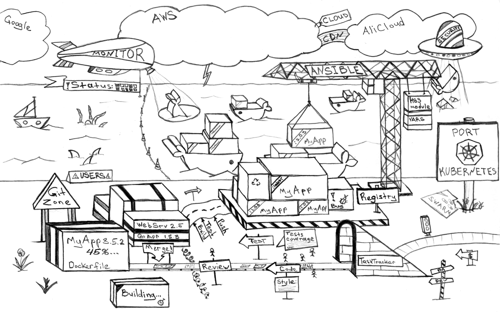
Crédits : Dmitriy Paunin

---

## Les containers Docker

Technologie de containérisation d'applications

* Sortie en 2013
* Utilise des fonctionnalités du kernel Linux
* Gestion via une interface "simple"
* Fourni un magasin d'images librement accessibles


---

## Docker et ses promesses

* Rend l'infra *facile* pour le dev
* Immutabilité (déploiements et mises à jours reproductibles) 
* ~ Economies (par rapport aux VMs)
* ~ Sécurité (isolation des applications)


---

## Retour à la réalité

**Techniquement** : réinvention des `jail` BSD avec une interface de management "simple" et des (très) gros binaires

Mais (à l'époque) Docker ne gérait pas *vraiment* :

* **la haute disponibilité**
* **la tolérance de panne**
* **les droits d'accès**

---

## Kubernetes

* Orchestrateur de containers

* Inspiré par un outil interne de Google

* Donné à la CNCF (spin-off Linux Foundation)

* Open Sourcé en 2015

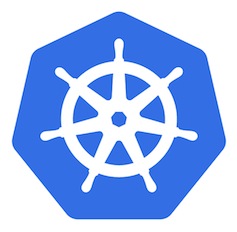

---

## T'aimes pas l'infra ? On va tout abstraire !

Décrire l'état souhaité de notre application et des composants d'infrastructure avec des API et du YAML

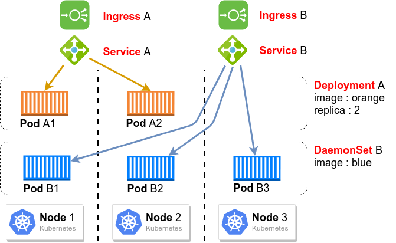

---

## APIs, APIs partout

Les APIs nous "cachent" toute la mécanique qui permet de déployer, maintenir et mettre à l’échelle nos applications

* **Apps**: *Pod, Deployment, ReplicaSet, DaemonSet, StatefulSet*
* **RBAC**: *Role, RoleBinding, ClusterRoleBinding, ServiceAccount*
* ...

<br/>

```console
kubectl --context prod api-resources --no-headers| wc -l
> 70
```

---

## C'est un outil verbeux

Lancer nginx dans **Docker**
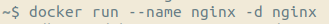
Versus dans **Kubernetes**
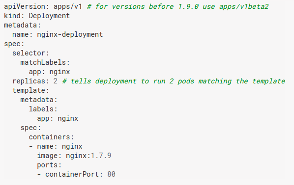

---

<!-- _class: lead -->

# What could possibly go wrong ?

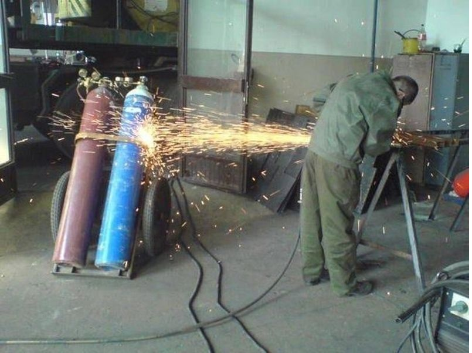

---

## Un outil complexe ? Pas grave, il y a une UI !

L'histoire récente regorge de failles et d'exploits sur des interfaces de management ouvertes sur Internet

* **phpMyAdmin**

* **tomcat-manager**

* **webmin**

* ...

---

## Et pourtant... Tesla ...

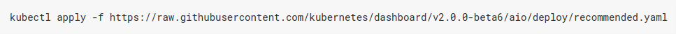

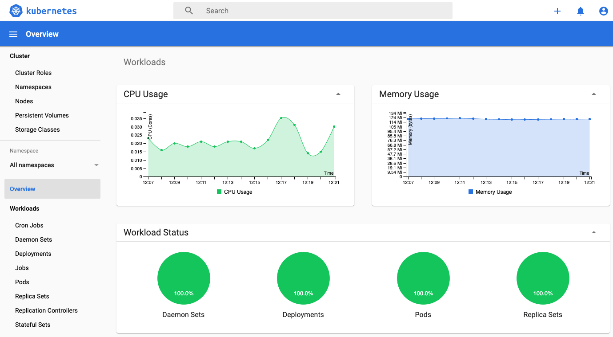

---

## “Not password protected”

> The hackers had infiltrated Tesla’s Kubernetes console which was **not password protected** / [Source : redlock.io](https://redlock.io/blog/cryptojacking-tesla)

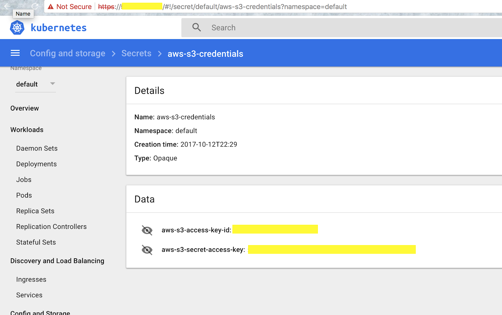

---

## Moralité : sortez couvert (sur Internet)

Vraiment.

**N'exposez pas la console.**
**Si vous ne l'utilisez pas, ne la déployez même pas.**

* Les clouds providers ne l'activent plus par défaut
* Préférez lui :
  * pour la gestion : `kubectl` ou des UIs locales (octant, lens)
  * pour la métrologie : **Grafana**, **Prometheus**, outils tiers

---

## Autre exemple : Kubeflow & Argo Workflow

* Dashboards pour planifier des tâches de Machine Learning 
* Machine Learning ⇒ serveurs avec GPUs
* 💸💸💸💸💸💸
<br/>

[zdnet - Un gang de crypto détourne des clusters K8s](https://www-zdnet-fr.cdn.ampproject.org/c/s/www.zdnet.fr/amp/actualites/microsoft-decouvre-un-gang-de-cryptomining-detournant-des-clusters-kubernetes-39905041.htm) / [bleeping computer - cryptominers on K8s via Argo Workflows](https://www.bleepingcomputer.com/news/security/attackers-deploy-cryptominers-on-kubernetes-clusters-via-argo-workflows/)

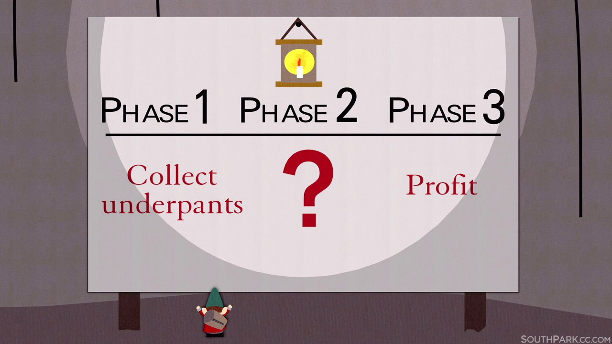

---

<!-- _class: lead -->

# Authentification

---

## Contrôle d'accès dans Kubernetes

* Kubernetes implémente le RBAC (Role-based access control)
  * Donner des droits fins
    * par type de ressource 
    * par type d'accès
  * De les affecter à des groupes d'utilisateurs ou d'applications

* Appliquez le [**principe de moindre privilège**](https://fr.wikipedia.org/wiki/Principe_de_moindre_privil%C3%A8ge)

---

## Le RBAC par l'exemple

&nbsp;&nbsp;&nbsp; 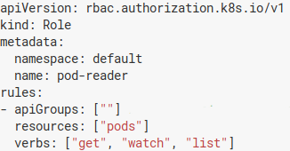 &nbsp; 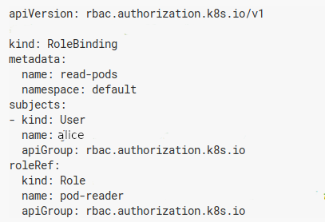

Ex. **alice** a le droit de lister les containers dans le namespace **default**, mais pas de les supprimer ni les créer.

---

## En cas de compromission

Si un compte utilisateur/application est compromis, les accès de l'attaquant seront limités à un périmètre donné :

* **Namespace** (subdivision logique du cluster)
* types d'actions précis pour chaque type de ressources

---

## Dans la pratique

* Le principe des moindres privilèges est un vrai chantier
  * **à mettre en place dès le début** du cycle de développement
  * plus difficile à appliquer *a posteriori* (sauf à tout bloquer)
* Pour auditer le RBAC :
  * `kubectl auth can-i`
  * [Aquasecurity `kubectl who-can`](https://github.com/aquasecurity/kubectl-who-can)
  * [Cyberark - KubiScan](https://github.com/cyberark/KubiScan)

---

## Utilisez une authentification tierce

Pas de gestion des (vrais) utilisateurs. Les applications/démons ont des **ServiceAccounts** authentifiés par :

- Tokens JWT
- Certificats (difficilement révocables 😭)

Ajouter une authentification tierce de type OIDC + RBAC

&nbsp;&nbsp;&nbsp;&nbsp;&nbsp;&nbsp;&nbsp;&nbsp;&nbsp;&nbsp;&nbsp;&nbsp;&nbsp;&nbsp;&nbsp;&nbsp;&nbsp;&nbsp;&nbsp;&nbsp;&nbsp;&nbsp;&nbsp;&nbsp;&nbsp;&nbsp;  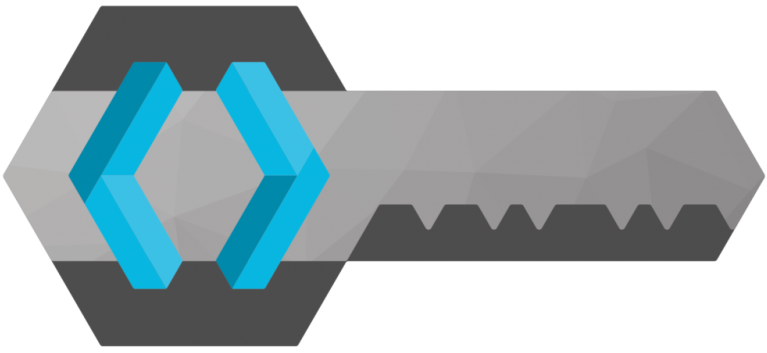

---

<!-- _class: lead -->

# “C’est toujours la faute du réseau”

---

## Architecture simplifiée de Kubernetes

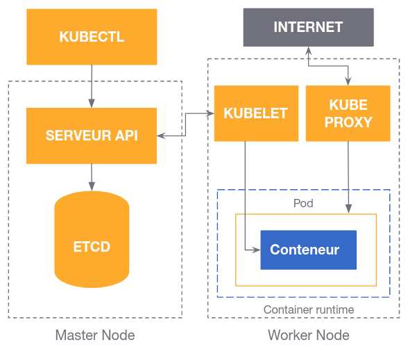

---

## Du TLS partout

Tous les flux devraient être chiffrés, *en particulier ceux de Kubernetes* lui-même (api-server, etcd, ...)

**Point Captain Obvious** : Si les flux ont été chiffrés, il sera plus difficile de récupérer des identifiants

Plus difficile de faire du [MITM](https://fr.wikipedia.org/wiki/Attaque_de_l%27homme_du_milieu)

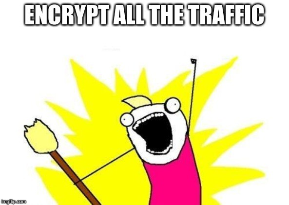

---

## Pas d'APIs sur Internet !

> 2000 Docker engines are insecurely exposed to the Internet [unit42 : Docker API + Graboid](https://unit42.paloaltonetworks.com/graboid-first-ever-cryptojacking-worm-found-in-images-on-docker-hub/)

> [...] but it was possible to connect from….the Internet [4armed : etcd + Digital Ocean](https://www.4armed.com/blog/hacking-digitalocean-kubernetes/)

> our coworker’s server was also publicly exposing the kubelet ports [Handy + kubelet](https://medium.com/handy-tech/analysis-of-a-kubernetes-hack-backdooring-through-kubelet-823be5c3d67c)

---

## Ajouter des Network Policies

Par défaut, Kubernetes *autorise tout container à se connecter à n'importe quel autre* **#OpenBar**

&nbsp;&nbsp;&nbsp;&nbsp;&nbsp;&nbsp;&nbsp;&nbsp;&nbsp; 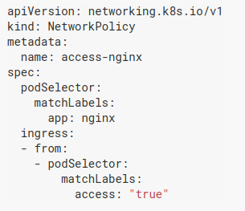 &nbsp;&nbsp;&nbsp;&nbsp; 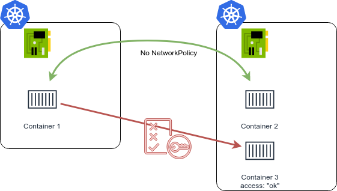

---

## Allégorie du "sac de nouilles" chez Monzo

**Monzo Bank** a mis en place des [Network Policies pour la totalité de ses 1500 microservices](https://monzo.com/blog/we-built-network-isolation-for-1-500-services) : 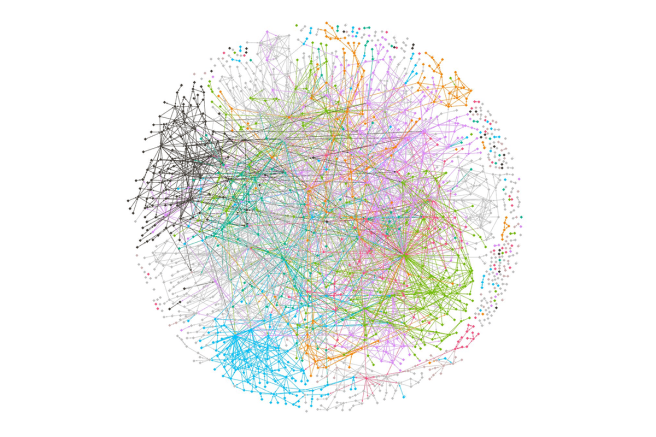

---

## Service Mesh !

Déléguer beaucoup d'aspects réseau+sécu au Service Mesh :
* gestion TLS
* monitoring
* firewalling / ACL
* analyse temps réel des attaques
  * audit/forensics, DDOS mitigation, ...

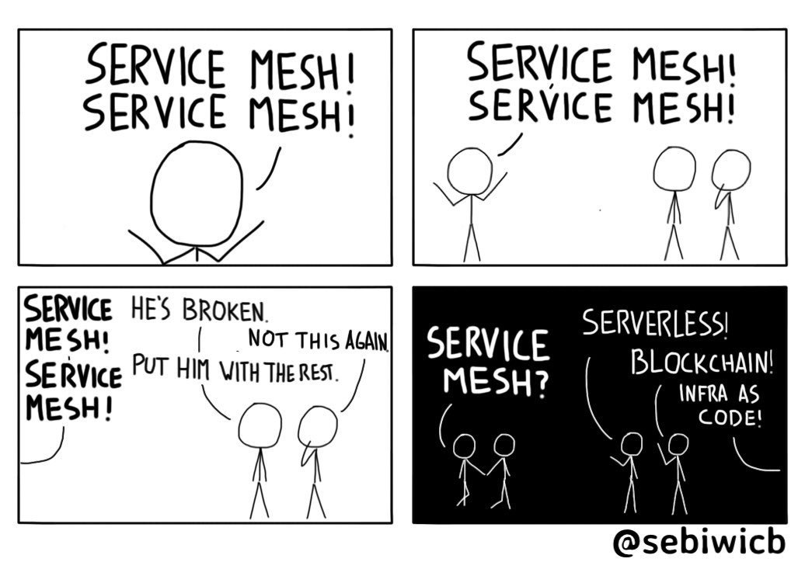

---

<!-- _class: lead -->

# Sécuriser les containers

---

## It's secure

> It's secure, because it's in a container


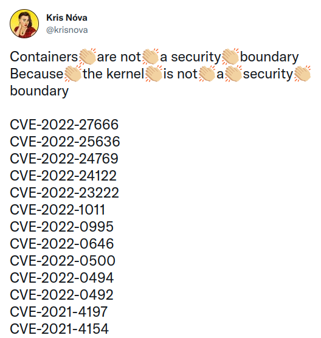

[twitter.com/krisnova](https://twitter.com/krisnova/status/1508911097700663297?s=20&t=K_BkkeXjb2nPW_G8a57UIQ)

---

## Ca vaut aussi pour Microsoft Windows !

**Siloscape** : Premier Malware à viser des workloads Kubernetes **sur des serveurs Windows**

> Microsoft originally didn't consider this issue a vulnerability, based on the reasoning that Windows Server containers are not a security boundary...

[The Register - Siloscape malware targets Windows containers, breaks through to the underlying Kubernetes cluster](https://www.theregister.com/2021/06/08/siloscape_malware_windows_containers/)

---

## Pas de container exécuté en tant que *root* !

Kubernetes utilise (pour l'instant) la table des users ID de l'hôte

binaire lancé en tant que **root** = binaire lancé en root sur l'hôte k8s

[Kubecon EU 2018: The route to Rootless Containers](https://www.youtube.com/watch?v=j4GO2d3YjmE)


---

## JW Player

Weave Scope (supervision) avait été créé avec des **privilèges** et **accessible depuis le net**

> Our deployment was missing the annotation to make the load balancer internal
> The `weave-scope` container is running with the `--privileged` flag
> Files on the root file system were mounted onto the container
> Containers are run as the `root` user.

[How A Cryptominer Made Its Way in our k8s Clusters](https://medium.com/jw-player-engineering/how-a-cryptocurrency-miner-made-its-way-onto-our-internal-kubernetes-clusters-9b09c4704205)

---

## Politiques de conformité

Kubernetes permet "trop" de choses

* ~~Pod Security Policy~~ 💥 DEPRECATED (1.21)
* A remplacer par Open Policy Agent  ou Kyverno 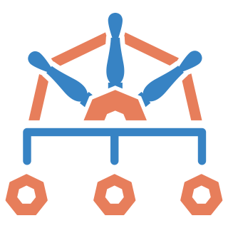

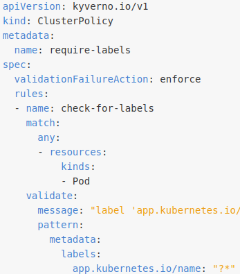

[Blog zwindler - Vos politiques de conformité sur Kubernetes avec OPA et Gatekeeper](https://blog.zwindler.fr/2020/07/20/vos-politiques-de-conformite-sur-kubernetes-avec-opa-et-gatekeeper/)

[Meetup Enix Jpetazzo - escalation via hostPath Volume](https://www.youtube.com/watch?v=z2P6n3Nj3ik)

---

## Analyse statique (static scan)

Des CVE sortent sur **NodeJS**, **.Net** et autre **JVM** toutes les semaines

Les images de bases de vos containers sont bourrées de failles

   ...

---

## Concrètement

Affiche les failles détectées pour chaque image Docker

Rajouter des **quality gates** (bloquants) côté *Intégration Continue*

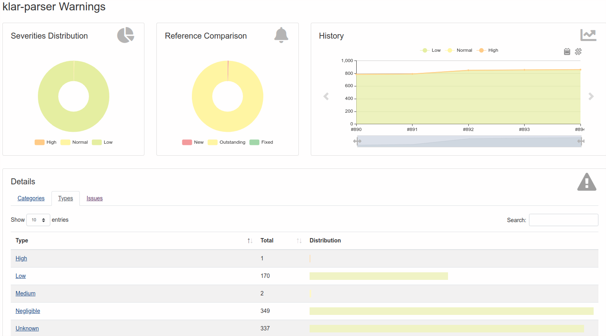

---

## Réduire la surface d'attaque

Limiter l'impact d'une compromission :

* Le moins de dépendances possibles
* Ne pas ajouter des binaires utiles aux attaquants
  * oubliez `ping`, `traceroute`, `gcc`, ...
* Multistage build (images build vs images run)
* **Pas de shell !**
* Sur les versions récentes : `kubectl debug`

---

## Vérifiez vos déploiements

* [Shopify kubeaudit](https://github.com/Shopify/kubeaudit) (audit des app déployées)
* [Octarinesec kube-scan](https://github.com/octarinesec/kube-scan) (risk assessment du type CVSS)

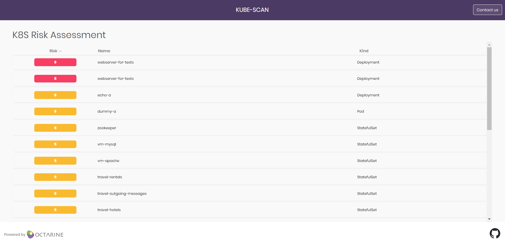

---

## Analyse *temps réel* (runtime scan)

Il existe aussi des *Intrusion Detection System* pour Kubernetes

  

> Falco is an open source project for intrusion and abnormality detection for Cloud Native platforms

> Cilium: eBPF-based Networking, Observability, and Security

---

## “Pourquoi diantre *GCC* tourne dans mon container ? 🤔🤔”

Programmes BPF pour détecter des comportements anormaux

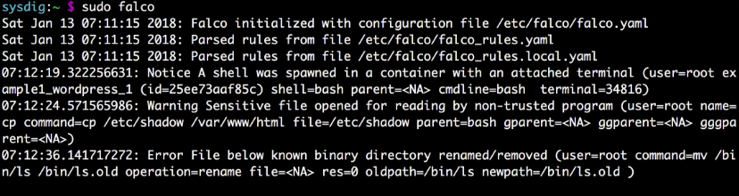

[Cilium Uncovering a Sophisticated Kubernetes Attack in Real-Time](https://www.youtube.com/watch?v=bohnofE_dvw)

---

<!-- _class: lead -->

# Et l'infra dans tout ça ?

---

## Kubernetes Security Audit

Comme tout logiciel, Kubernetes a des failles !

Août 2019 : la CNCF a commandé un audit du code de Kubernetes

* Commencé sur un périmètre restreint
* Généralisé à tous les nouveaux composants entrant dans la CNCF
* A permis de déceler 37 vulnérabilités

---

## Des k8s et des CVEs

* **2018** / faille dans l'API server
  * [ZDnet](https://www.zdnet.fr/actualites/kubernetes-la-premiere-grosse-faille-est-la-39877607.htm)
* **2019** / faille dans RunC pour sortir du container
  * [LeMondeInformatique](https://www.lemondeinformatique.fr/actualites/lire-une-faille-dans-runc-rend-vulnerable-docker-et-kubernetes-74312.html)
* **2020** / faille dans le controller manager
  * [Medium BreizhZeroDayHunters](https://medium.com/@BreizhZeroDayHunters/when-its-not-only-about-a-kubernetes-cve-8f6b448eafa8)
* **2021 et ++**


---

## Moralité : mettez à jour régulièrement !


... en vrai, c'est pas forcément simple

[Kubecon EU 2018 - Zalando Continuously Deliver your K8s Infra](https://static.sched.com/hosted_files/kccnceu18/18/2018-05-02%20Continuously%20Deliver%20your%20Kubernetes%20Infrastructure%20-%20KubeCon%202018%20Copenhagen.pdf)

---

## Trust... but verify

* [Aquasecurity kube-hunter](https://github.com/aquasecurity/kube-hunter) (scan de vulnérabilité triviales)
 [Aquasecurity kube-bench](https://github.com/aquasecurity/kube-bench) (benchmark type CSI)
* [Armosec Kubescape](https://github.com/armosec/kubescape) (tout en un)

> K8s single pane of glass, including risk analysis, security compliance, RBAC visualizer and image vulnerabilities scanning

<br/>

[Exemple d'attaque via Unauthenticated Kubelet](https://www.cyberark.com/resources/threat-research-blog/using-kubelet-client-to-attack-the-kubernetes-cluster)

--- 

<!-- _class: lead -->

# “C'est bon, c'est safe”


---

## There is a lot to Secure 

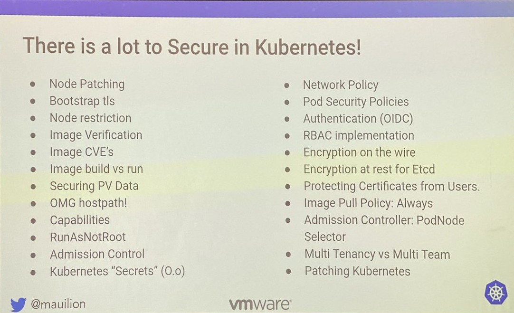

[Source: Kubernetes Security / Duffie Cooley](https://github.com/mauilion/vegas-meetup-2019/blob/master/k8s_security.pdf)

---

## Conclusion

* Ne déployez pas Kubernetes pour de mauvaises raisons 
(aka. si vous n'en avez pas besoin !)
  * Mais si vous pouvez le faire, faites le !
  * [blog : combien de problèmes ces stacks ont générés ?](https://blog.zwindler.fr/2019/09/03/concerning-kubernetes-combien-de-problemes-ces-stacks-ont-generes/)
<br/>

* Il y a beaucoup de choses à sécuriser dans Kube
  * Formez vos développeurs, pas seulement les Ops !
  * Sécurisez dès le début

---

## That's all folks


---

## Des questions ?


---

<!-- _class: lead -->

# Sources

---

## Les best practices

* [Kubernetes.io : 11 ways not to get hacked](https://kubernetes.io/blog/2018/07/18/11-ways-not-to-get-hacked/)
* [Sysdig : Container security best practices](https://sysdig.com/blog/container-security-best-practices/)
* [Rancher : More Kubernetes best practices](https://rancher.com/blog/2019/2019-01-17-101-more-kubernetes-security-best-practices/)
* [Stackrox : kubernetes security 101](https://www.stackrox.com/post/2019/07/kubernetes-security-101/?utm_sq=g6zvjgb9og#final-thoughts-ensure-you-can-answer-these-12-questions-about-your-container-and-kubernetes-environment)
* [Jerry Jalava : Kubernetes Security Journey](https://fr.slideshare.net/jerryjalava/kubernetes-security-journey)
* [Duffie Cooley (VMware) : Kubernetes Security](https://github.com/mauilion/vegas-meetup-2019/blob/master/k8s_security.pdf)


---

## Les outils pour durcir Kube (1/2)

* [Scan de vulnérabilité triviales : kube-hunter](https://github.com/aquasecurity/kube-hunter)
* [Benchmark CSI de votre installation : kube-bench](https://github.com/aquasecurity/kube-bench)
* [Audit des app déployées : kubeaudit](https://github.com/Shopify/kubeaudit)
* ["Risk assessment" du type CVSS : kube-scan](https://github.com/octarinesec/kube-scan)
* [OPA / OnePolicyAgent](https://blog.octo.com/durcissez-votre-kube-avec-openpolicyagent/)
* [blog.zwindler.fr - Vos politiques de conformité sur Kubernetes avec OPA et Gatekeeper](https://blog.zwindler.fr/2020/07/20/vos-politiques-de-conformite-sur-kubernetes-avec-opa-et-gatekeeper/)
* [Kyverno](https://kyverno.io/)
* [Aurélie Vache - Understanding Kubernetes visual way - Kyverno](https://dev.to/aurelievache/understanding-kubernetes-part-44-tools-kyverno-52mc)

---

## Les outils pour durcir Kube (2/2)

* [Analyse statique : Clair](https://coreos.com/clair/docs/latest/)
* [Analyse statique : Anchore](https://anchore.com/)
* [Analyse statique : Trivy](https://github.com/aquasecurity/trivy)
* [Analyse runtime : Falco](https://falco.org/)
* [SELinux, Seccomp, Falco, a technical discussion](https://sysdig.com/blog/selinux-seccomp-falco-technical-discussion/)
* [Access, Assert, Act. La sécurité à l'échelle avec Falco 🦅 ](https://speakerdeck.com/ebriand/access-assert-act-la-securite-a-lechelle-avec-falco)
* [CNI + analyse runtime : Cilium](https://cilium.io/)
* [Cyberark : KubiScan (audit RBAC)](https://github.com/cyberark/KubiScan)
* [Armosec - Kubernetes Security Compliance Frameworks](https://www.armosec.io/blog/kubernetes-security-frameworks-and-guidance/)

---

## Les failles de sécu récentes de K8s (&+)

* [Faille dans RunC (Docker, Kubernetes et Mesos concernés)](https://www.lemondeinformatique.fr/actualites/lire-une-faille-dans-runc-rend-vulnerable-docker-et-kubernetes-74312.html)
* [Liste des CVE Kubernetes](https://www.cvedetails.com/vulnerability-list/vendor_id-15867/Kubernetes.html)
* [ZDnet : La première grosse faille de sécurité est là (API server)](https://www.zdnet.fr/actualites/kubernetes-la-premiere-grosse-faille-est-la-39877607.htm)
* [L'exploit pour la faille dans l'API Server](https://www.twistlock.com/labs-blog/demystifying-kubernetes-cve-2018-1002105-dead-simple-exploit/)
* [Audit du code en aout 2019 : article principal](https://www.cncf.io/blog/2019/08/06/open-sourcing-the-kubernetes-security-audit/)
* [Audit du code en aout 2019 : audit en lui même](https://github.com/kubernetes/community/blob/master/wg-security-audit/findings/Kubernetes%20Final%20Report.pdf)

---

## Les sociétés hackées dans la presse (1/2)

* [2018 : Cryptojacking chez Tesla](https://redlock.io/blog/cryptojacking-tesla)
* [2019 : Cryptojacking chez jwplayer](https://medium.com/jw-player-engineering/how-a-cryptocurrency-miner-made-its-way-onto-our-internal-kubernetes-clusters-9b09c4704205)
* [Plus d'infos sur le cryptominer XMrig](https://news.sophos.com/fr-fr/2019/05/31/eternel-retour-cryptomineur-xmrig/)
* [ZDNET : des hackers utilisent les API de management de Docker exposées sur le net](https://www.zdnet.com/article/a-hacking-group-is-hijacking-docker-systems-with-exposed-api-endpoints/)
* [zdnet - Microsoft découvre un gang de cryptomining détournant des clusters Kubernetes](https://www-zdnet-fr.cdn.ampproject.org/c/s/www.zdnet.fr/amp/actualites/microsoft-decouvre-un-gang-de-cryptomining-detournant-des-clusters-kubernetes-39905041.htm)
* [4armed : Server-Side Request Forgery + **etcd** accessible depuis Internet chez Digital Ocean](https://www.4armed.com/blog/hacking-digitalocean-kubernetes/)

---

## Les sociétés hackées dans la presse (2/2)

* [Un cluster perso d'un employé de Handy laisse son kubelet ouvert sur Internet](https://medium.com/handy-tech/analysis-of-a-kubernetes-hack-backdooring-through-kubelet-823be5c3d67c)
* [Azure Container Instance (docker managé Azure) permettait l'accès cross account](https://thehackernews.com/2021/09/microsoft-warns-of-cross-account.html)
* [bleeping computer - cryptominers on K8s via Argo Workflows](https://www.bleepingcomputer.com/news/security/attackers-deploy-cryptominers-on-kubernetes-clusters-via-argo-workflows/)
* [The Register - Siloscape malware targets Windows containers, breaks through to the underlying Kubernetes cluster](https://www.theregister.com/2021/06/08/siloscape_malware_windows_containers/)

---

## Autre (1/2)

* [Outil d'audit des rôles](https://github.com/Ladicle/kubectl-bindrole?utm_sq=g502s0hv29)
* [Une liste d'outils permettant d'auditer le RBAC dans Kubernetes](https://twitter.com/learnk8s/status/1190859981811277824?s=19)
* [Une image XMRig (Monero) sur le Dockerhub](https://unit42.paloaltonetworks.com/graboid-first-ever-cryptojacking-worm-found-in-images-on-docker-hub/)
* [Twitter : "There is a lot to Secure in Kubernetes"](https://twitter.com/popsysdig/status/1185263894916411404?s=19)
* [DNS Spoofing on Kubernetes Clusters](https://blog.aquasec.com/dns-spoofing-kubernetes-clusters?utm_sq=g7xa5xquzi)
* [Docker and Kubernetes Reverse shells](https://raesene.github.io/blog/2019/08/09/docker-reverse-shells/)
* [Exploiter un Tomcat Manager non sécurisé](https://www.hackingarticles.in/multiple-ways-to-exploit-tomcat-manager/)
* [Backdoor dans webmin](https://pentest.com.tr/exploits/DEFCON-Webmin-1920-Unauthenticated-Remote-Command-Execution.html)

---

## Autre (2/2)

* [Manoj Sharma / Medium - Starting with Kubernetes Security](https://manoj-sharma-sec.medium.com/starting-with-kubernetes-security-1a3773ecf3d1)
* [Github - Kubernetes Security - Best Practice Guide](https://github.com/freach/kubernetes-security-best-practice)
* [Github - Awesome Kubernetes (K8s) Security](https://github.com/magnologan/awesome-k8s-security)
* [Peirates - Kubernetes Penetration testing tool](https://www.inguardians.com/peirates/)
* [Kubecon EU 2018 - Zalando Continuously Deliver your K8s Infra](https://static.sched.com/hosted_files/kccnceu18/18/2018-05-02%20Continuously%20Deliver%20your%20Kubernetes%20Infrastructure%20-%20KubeCon%202018%20Copenhagen.pdf)
* [Meetup Enix Jpetazzo - escalation via hostPath Volume](https://www.youtube.com/watch?v=z2P6n3Nj3ik)
* [blog.zwindler.fr - Should we have containers ?](https://blog.zwindler.fr/2016/08/25/when-should-we-have-containers/)
* [blog.zwindler.fr - Combien de problèmes ces stacks ont générés ?](https://blog.zwindler.fr/2019/09/03/concerning-kubernetes-combien-de-problemes-ces-stacks-ont-generes/)
