

<!-- _class: lead -->

---

## ~$ whoami

Denis GERMAIN

- Staff SRE  chez 
- Blog tech (et +) : [blog.zwindler.fr](https://blog.zwindler.fr)*
 

  [@zwindler(@framapiaf.org)](https://framapiaf.org/@zwindler)

**#geek** 👨‍💻 **#SF** 🤖👽 **#courseAPied** 🏃‍♂️

 

**Les slides de ce talk sont sur le blog*

---

<!-- _class: lead -->

---

<!-- _class: lead -->

# Pourquoi ce talk ?

---

## "SRE, je connais, c'est comme DevOps !"

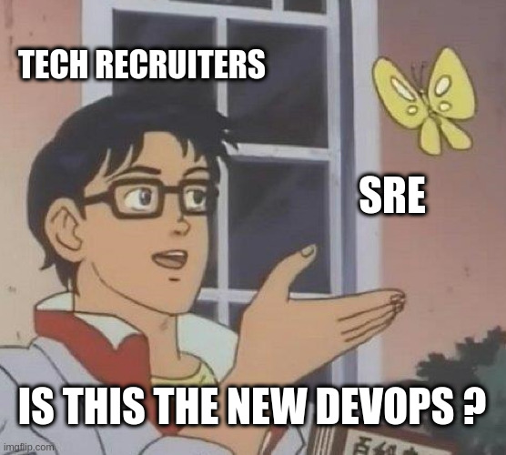 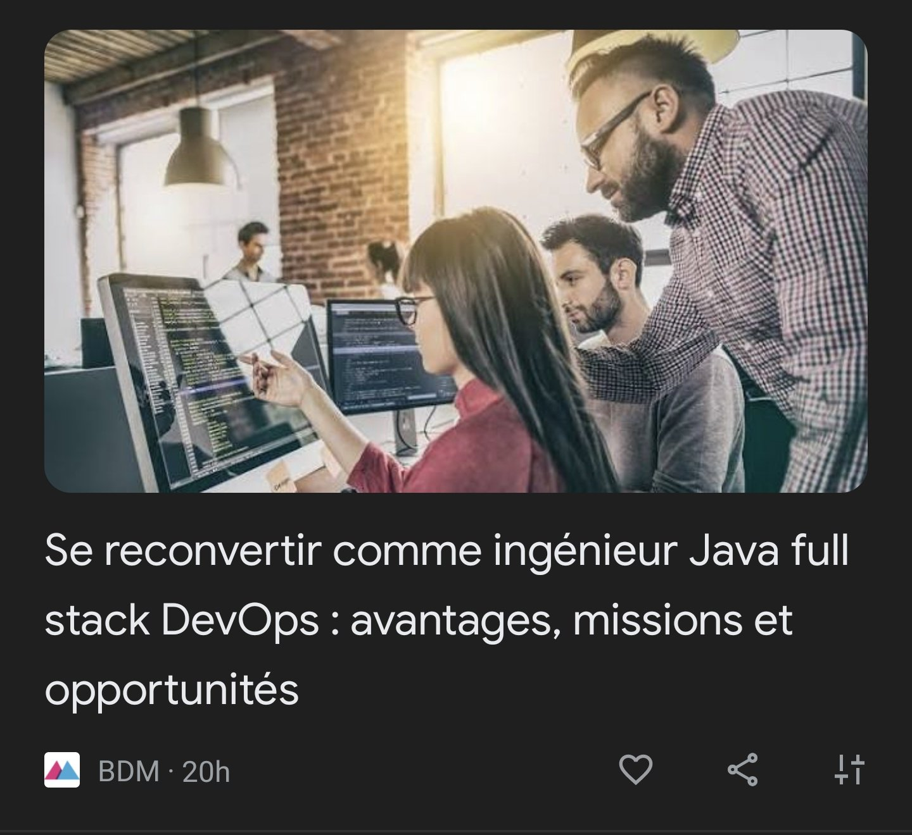

---

## Alors qu'en vrai, c'est plutôt ça

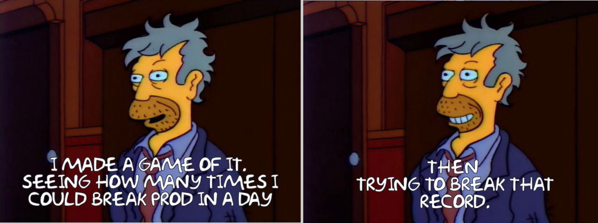

[Simpsons Against DevOps](https://twitter.com/SimpsonsOps/status/1372002900189212674?s=20)

---

<!-- _class: lead -->

# Back to basics

---

## "Mais ça, c'était avant !"

 

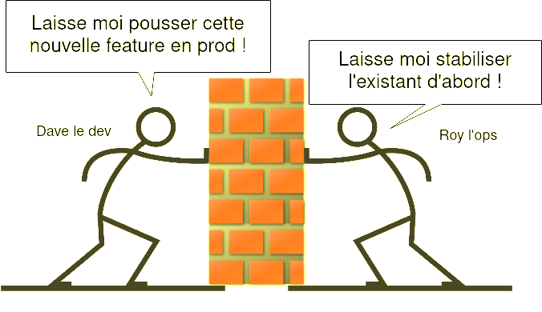

---

## DevOps

Courant de pensée théorisé ~2008 ([Patrick Debois](https://www.jedi.be/blog/))
- Amélioration continue sur cycles courts
- Déploiements réguliers, testés, automatisés
- Surveillance de l'exploitation et de la qualité

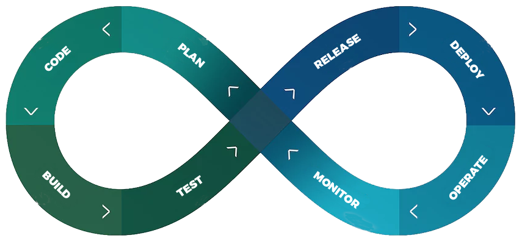

---

## DORA 👧🐒🎒📜

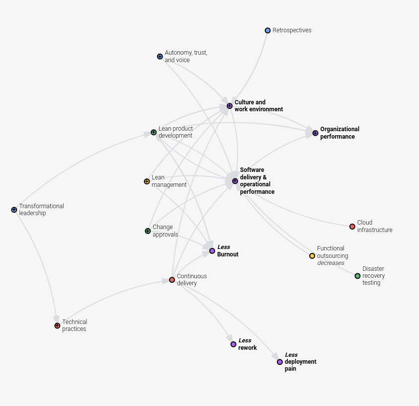

- [DORA - Devops Research and Assessment](https://www.devops-research.com/research.html)
  - 7 ans / 32000 pros
  - Meilleurs "performers" 
  - Leurs *pratiques* 

* Pour moi DevOps c'est ... ?
  - Outillage
  - Culture d'entreprise & "agilité"

---

## Software delivery performance

- "5 key metrics"
  - Lead Time
  - Mean Time To Restore
  - Change Fail Percentage
  - Deployment Frequency
  - (NEW) Reliability

[DORA DevOps Quick Check](https://www.devops-research.com/quickcheck.html)

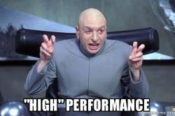

---

## Culture d'entreprise

Performers : culture de l'information, de l'apprentissage (CoP) et culture de la confiance (sécurité psychologique, *blameless*)

> High-trust and emphasizes information flow is predictive of software delivery performance and organizational performance in technology

[Pourquoi DevOps ne tient pas ses promesses ? (Gérôme Egron et Guillaume Mathieu)](https://www.youtube.com/watch?v=Nyga5cdvgbo) / [DORA - DevOps Culture](https://cloud.google.com/solutions/devops/devops-culture-westrum-organizational-culture)

---

<!-- _class: lead -->

# Et Google inventa les SREs

---

## Qui a inventé le SRE ? (1/2)

- Ben Treynor Sloss (VP engineering @Google)
- 2003 (bien avant DevOps !)
  
> SRE is what happens when you ask a **software engineer** to design an **operations team**

 
 

[SRE book - Introduction](https://sre.google/sre-book/introduction/)

---

## Qui a inventé le SRE ? (2/2)

> - 50–60% are Google Software Engineers
> - The other 40–50% are candidates who were very close to the qualifications, **and who in addition** had a set of skills useful to SRE but is rare for software engineers.

 

[SRE book - Introduction](https://sre.google/sre-book/introduction/)
[Class SRE implements DevOps (playlist YouTube)](https://www.youtube.com/playlist?list=PLIivdWyY5sqJrKl7D2u-gmis8h9K66qoj)

---

<!-- _class: lead -->

# Les principes du SRE

---

## Toil (tears and sweat)

> Contrairement aux Ops (sic), les Devs détestent faire des tâches répétitives

- Travail **manuel**, **répétitif**, **automatisable**, **sans valeur ajoutée**, **augmente linéairement avec la capacité**
- Réduit le moral des équipes, pas scalable ⇒ cercle vicieux

 

[SRE book - Eliminating toil](https://sre.google/sre-book/eliminating-toil/)

---

## Réduire le toil

- Automatiser les tâches répétitives 
- Développer du tooling interne
- **Documenter** 
  - ops & astreinte
- Corriger les problèmes de fiabilité (post-incident)

 

[xkcd/1205: Is It Worth the Time?](https://xkcd.com/1205/)

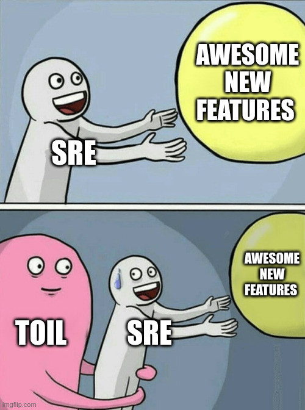

---

## Observabilité

- Système distribué **==** système complexe
  - Difficile d'avoir une vue d'ensemble !
- Instrumenter les services, au fur et à mesure
- S'inspirer des 4 golden signals
  - Latence, Trafic, Erreurs, Saturation
- Black box, White box
- Attention à ne pas tout observer !

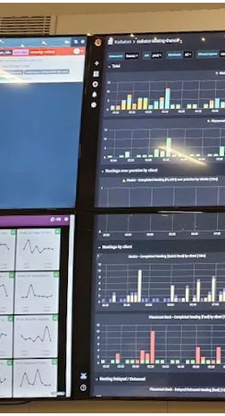

---

## Astreinte

- Documenter les services
  - Faire des schémas d'infra
  - Avoir une vision claire de l'ownership
  - Donner des commandes simples
- Scenarii [Wheel of misfortune](https://dastergon.gr/wheel-of-misfortune/), war rooms, Chaos engineering, ...

 

[Doctolib - First time on call](https://medium.com/doctolib/first-time-sre-on-call-discovering-b49a1a0361ae)

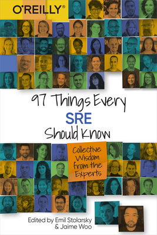

---

## Postmortems ☠️

Rapidement après un incident, écrire un postmortem

- Timeline des événements
- Compréhensible et détaillée
  - causes, conséquences, investigation, résolution
- Actions correctives postérieures
- et surtout...

[How to Fight Production Incidents?](https://asatarin.github.io/talks/2023-01-how-to-fight-incidents/)

---

<!-- _class: lead -->

# Les principes du SRE (suite)
## Ok, mais c'est quoi la *diff* avec sysadmin ?

---

## Accepter les pannes comme "normales"

> 100% is the **wrong** reliability target for basically everything
> -- Ben Trainoy Sloss

- Plus on veut de **9**, plus ça demande des efforts (e^)
  - les utilisateurs ne voient plus la différence
  - temps d'ingénierie pas alloué aux fonctionnalités
  - parfois c'est même contre-productif !

[SRE book - Global Chubby Planned Outage](https://sre.google/sre-book/service-level-objectives/)

---

## *BLAMELESS* postmortems ☠️

- *Blameless* (conséquence de "accept failure as normal")
- "sécurité psychologique"

 
 
 
 

[Blameless.com - Post-mortems best practices](https://www.blameless.com/incident-response/5-best-practices-nailing-postmortems)
[DanvOps - Comment faire d'un échec un moyen de s'améliorer](https://danvops.fr/2021/sre-postmortem/)

---

## ~~Site~~ Business Reliability Engineer
> Est ce que le **client** est content d'utiliser le service ?
* $\frac{Bonnes\ interactions}{Total\ des\ interactions}$ = %$^{age}$ utilisateurs trouvent le service fiable

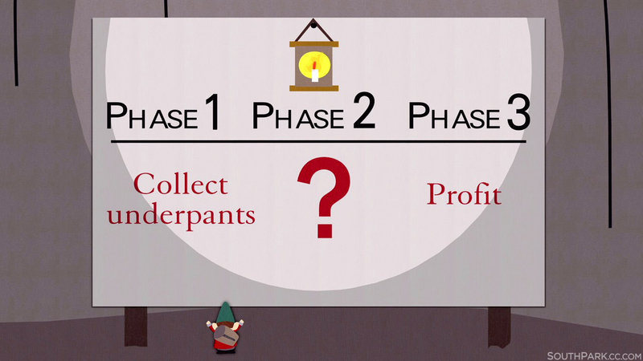

---

## CUJ / SLI / SLO

> If reliability is a feature, how do you prioritize it instead of other features?

1. Déterminer des "Critical User Journey"
1. SLI: Indicateurs sur la fiabilité du service (dispo, latence)
1. SLO: Objectif de fiabilité du service (ex. 99,9% < 30ms)

[Practical Guide to setting SLOs](https://cloud.google.com/blog/products/management-tools/practical-guide-to-setting-slos ) / [SLOs at BlaBlaCar](https://medium.com/blablacar/slos-at-blablacar-59a126622c3e) / [métriques S.M.A.R.T.](https://en.wikipedia.org/wiki/SMART_criteria)

---

## Error budgets

On inverse la logique de la disponibilité

- Service accessible 99,9% **==** inaccessible 0,1% du temps

 

> Une métrique objective qui permet de déterminer à quel point un service peut être non-fiable pendant une période donnée sans que ça n'impacte le business

---

## J'en fais quoi, *moi*, de ton Error Budget ?

Contre-intuitivement... **IL FAUT L'UTILISER**

- SLO atteint **⇔** utilisateurs contents (!!!)
  - Faire les interventions disruptives
  - Faire des tests "risqués", chaos eng., etc.
- SLO pas atteint **⇔** pas *grave* 
  - Prioriser **tout** ce qui améliore la fiabilité

---

## Pas si faux, finalement

[Simpsons Against DevOps](https://twitter.com/SimpsonsOps/status/1372002900189212674?s=20)

---

<!-- _class: lead -->

# Et IRL, ça se passe comment ?

---

## Dans quel cas ça ne marche pas ?

- Les Errors Budgets sont une réponse **organisationnelle**
- Priorité aux nouvelles fonctionnalités si le service est "fiable"
- Stakeholders qui n'adhèrent pas = intéret des principes SRE faible

--- 

## Ce qu'on attend d'un SRE

- Déployer et **maintenir l'infrastructure**
- **Développer** (tooling /réduire toil)
- **Diffuser les bonnes pratiques**
  - Monitoring / observabilité
  - Définir (ou aider à définir) les SLO/SLI/error budgets
- Être d'astreinte (+ post-mortems)

[Spike - SRE 2021 / 30 job postings analysis](https://spike.sh/blog/sre-role-2021-analysed-30-job-postings) / [memenetes](https://twitter.com/memenetes/status/1316846480351809537?s=20)

---

## Quelle "personnalité" pour être SRE ?

⚠️ **Totalement subjectif et probablement biaisé** ⚠️

- Vouloir faire de l'infra (si on est Dev)
- Ne pas avoir peur du code (si on est Ops)
- Détester les tâches répétitives (*👋 Ben Treynor Sloss*)
- Être tenace, ...
  - ... mais savoir rester réaliste !
- **Aimer transmettre / communiquer, faire preuve d'empathie**

---

## Quelles compétences ?

- Linux & les bases en réseau
- 1 langage & git
- 1 cloud provider
- 1 outil d'automatisation / IaC
- 1 outil de monitoring
- Quelques outils "Cloud-native"

[Padok - De dev à SRE](https://www.padok.fr/blog/developpeur-sre) / [Reddit - "go into DevOps"](https://www.reddit.com/r/linuxadmin/comments/65vb8s/advice_if_you_are_wanting_to_go_into_devops/) / [Roadmap to DevOps](https://roadmap.sh/devops) / [Tweet Anas Khan](https://twitter.com/m_anas_dev/status/1499725358605938688?s=20&t=MopH_0yc-8P125hqULhViw)

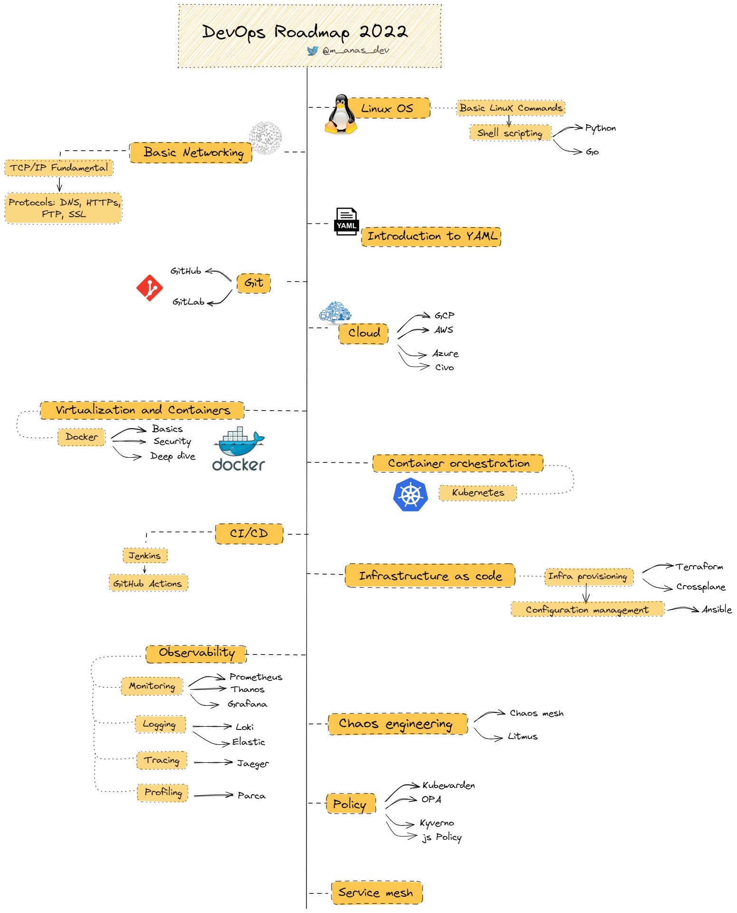

---

<!-- _class: lead -->

# Conclusion

---

## Conclusion

- Proche de la philosophie DevOps
- Métier "inventé" par Google
- Applicable ailleurs **si** le top management s'implique
- Explicitez ce que vous attendez d'un SRE dans les annonces

 [@zwindler](https://twitter.com/zwindler)
 Slides sur [blog.zwindler.fr](https://blog.zwindler.fr/conf%C3%A9rences/)

---

<!-- _class: lead -->

# Sources

---

## Aller plus loin sur le SRE

- [Google - SRE Book (v1, philosophie du SRE)](https://sre.google/sre-book/table-of-contents/)
- [Google - SRE Workbook (v2, comment l'implémenter)](https://sre.google/workbook/preface/)
- [O'Reilly - 97 every SRE should know](https://www.oreilly.com/library/view/97-things-every/9781492081487/)
- [Google - Class SRE implements DevOps (playlist Youtube)](https://www.youtube.com/playlist?list=PLIivdWyY5sqJrKl7D2u-gmis8h9K66qoj)
- [Google - Workshops sur les SLOs](ttps://sre.google/resources/practices-and-processes/art-of-slos/)

---

## DevOps

- [DORA - Devops Research and Assesment](https://www.devops-research.com/research.html)
- [DORA - Site du "State of DevOps"](https://cloud.google.com/devops#read-dora%E2%80%99s-state-of-devops-reports-and-devops-roi-whitepaper)
- [DORA - State of Devops 2019](https://services.google.com/fh/files/misc/state-of-devops-2019.pdf) et [2021](https://services.google.com/fh/files/misc/state-of-devops-2021.pdf)
- Arie Bregman - [Devops Exercices](https://github.com/bregman-arie/devops-exercises) et [Devops Resources](https://github.com/bregman-arie/devops-resources)
- Michael Cade - [90DaysOfDevOps](https://github.com/MichaelCade/90DaysOfDevOps)
