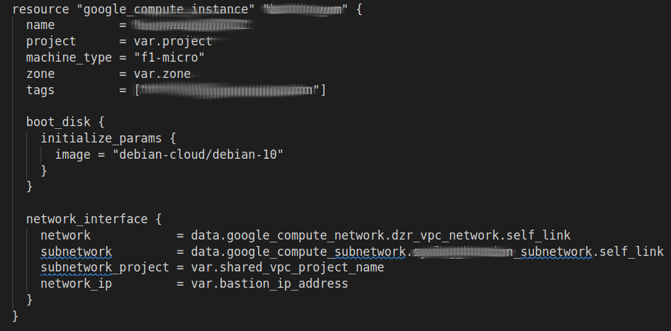
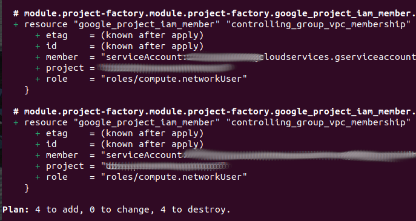
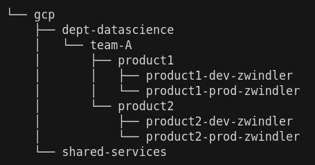
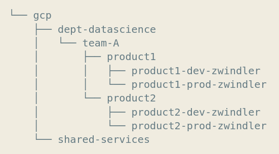

<!-- _class: lead -->

# Du code Terraform  **vraiment** factorisé avec Terragrunt 👹 !

---

## ~$ whoami

Denis GERMAIN

- SRE - Techlead  chez 
- Blog tech (et +) : [blog.zwindler.fr](https://blog.zwindler.fr)*
 

 [@zwindler](https://twitter.com/zwindler)

**#geek** 👨‍💻 **#SF** 🤖👽 **#courseAPied** 🏃‍♂️

 

**Les slides de ce talk sont sur le blog*

---

<!-- _class: lead -->

# Du code Terraform  **vraiment** factorisé avec Terragrunt 👹 !

---

## Pourquoi parler de Terragrunt ?

- Utile chez 
- Un outil utilisé par pas mal de monde
  
- Très peu de ressources en dehors de la documentation officielle

---

## Mais... c'est quoi Terraform  déjà ?

- Décrit l'état souhaité de notre infrastructure avec un DSL
- L'infrastructure devient
  - collaborative
  - versionnée
  - reproductible (répétable)

> [Terraform](https://www.terraform.io/) is an open-source **[infrastructure as code](https://en.wikipedia.org/wiki/Infrastructure_as_code)** software tool that provides a consistent CLI workflow to manage cloud services. 

---

## A quoi ressemble le code ?

- Hashicorp utilise son propre DSL (le HCL) pour décrire l'infra

---

## A quoi le "plan" ?

- Terraform stocke l'état actuel de l'infra (fichier **state**)
- Au "plan" :  fait la différence entre le **state** et l'état souhaité

--- 

## Terraform chez 

On utilise **beaucoup** terraform !

- 900 fichiers terraform (“.tf”)
- 35k+ lignes de code
- ~4000 commits
- 1400+ pull requests
- ~40 contributeurs (SREs, devs, prestas, ...)
 

 [@zwindler](https://twitter.com/zwindler)

---

## Les limites de Terraform 

- Monorepo *avec un seul state*
  - Blocage régulier du state
  - Temps de "plan" longs

- Plurirepo (un repo par projet)
  - Code copié/collé d'un projet/équipe à l'autre
  - Erreurs humaines
  - Mauvaises pratiques potentiellement dupliquées

---

## Les limites de Terraform 

- Monorepo *avec plusieurs states*
  - chaque dossier contient un "projet"

- On peut factoriser :
  - une partie du code avec des [modules](https://www.hashicorp.com/blog/new-guides-terraform-modules)
  - une partie de la configuration avec les [tfvars](https://learn.hashicorp.com/tutorials/terraform/variables#assign-values-with-a-terraform-tfvars-file) et les [tfworkspaces](https://www.terraform.io/language/state/workspaces)

- Il reste encore du code dupliqué (variables)

[Padok - Terraform Workspaces](https://www.padok.fr/en/blog/terraform-workspaces)

---

## Terragrunt à la rescousse

- Wrapper pour terraform 
- Développé par [Gruntwork](https://gruntwork.io/) 
  - aussi éditeur de [terratest](https://terratest.gruntwork.io/)
- Philosophie DRY ([Don't Repeat Yourself](https://en.wikipedia.org/wiki/Don%27t_repeat_yourself))

 
 
 

[Github.com - Code source et distributions](https://github.com/gruntwork-io/terragrunt)

---

## It's time to D-D-D-D-D-DEMO !

---

## Objectif de la démo

- Déployer des folders/projects sur GCP avec terraform 
- Factoriser la totalité des variables de mon projet
  - Soit en les mutualisant dans l'arborescence
  - Soit en utilisant des fonctionnalités de Terragrunt

---

## Récap'

- Factorisé toutes les variables
  - soit en les mutualisant dans l'arborescence
  - soit en utilisant des fonctions de Terragrunt pour les "deviner"
- Factorisé la conf du **remote state**
- Appliqué des modifications à plusieurs projets en une commande

---

## Conclusion

- Parfois c'est un peu de la "bidouille" 
  - mais aussi avec Terraform 
- Utile à partir d'une certaine taille
  - nécessite rigueur et réflexion préalable
- Pas tellement complexe
  - mais peu de ressources sur le net

 [@zwindler](https://twitter.com/zwindler)
 Slides et sources sur [blog.zwindler.fr](https://blog.zwindler.fr/conf%C3%A9rences/)

---

<!-- _class: lead -->

# Sources

---

## Quelques billets de blogs qui en parle

- [Ichi pro - Gardez votre code terraform "sec"](https://ichi.pro/fr/terragrunt-comment-garder-votre-code-terraform-sec-et-maintenable-270595294583256) (FR)

- [easyteam FR - Configuration DRY avec terragrunt](https://easyteam.fr/terraform-remote-state-configuration-dry-avec-terragrunt/) (FR)

- [gaunacode - on Azure](https://gaunacode.com/using-terragrunt-to-deploy-to-azure) (EN)

- [myshittycode - run-all & outputs](https://myshittycode.com/2019/10/30/terragrunt-plan-all-while-passing-outputs-between-modules/) (EN)

- [transcend - why we use terragrunt](https://transcend.io/blog/why-we-use-terragrunt/) (EN)

- [geekculture - terragrunt cheat sheet](https://medium.com/geekculture/terragrunt-cheat-sheet-bedafbf9d61f) (EN)

---

## Quelques dépôts git d'examples

- [Le code de ce talk - zwindler/terragrunt-101](https://github.com/zwindler/terragrunt-101)

- [Exemple officiel](https://github.com/gruntwork-io/terragrunt-infrastructure-live-example)

- [paddymorgan84 - terragrunt example](https://github.com/paddymorgan84/terragrunt-tutorial/tree/terragrunt)

- [pie-r - terragrunt vs terraspace](https://github.com/pie-r/terragrunt-vs-terraspace)
