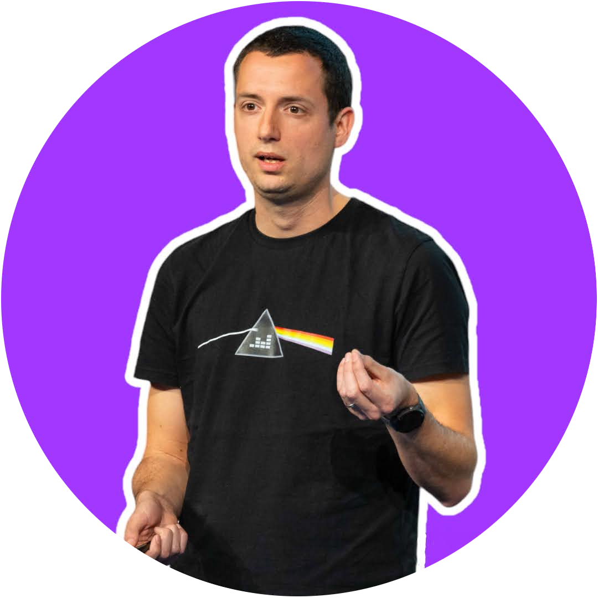

<!-- _class: lead -->

## Petit oral Lucca

 
 

### Denis Germain
### 22 avril 2024

---

## Denis Germain 👨‍💻

- Diplômé Ingénieur en informatique (ENSEIRB)
- 2010-2012 - Ingénieur Systèmes - Sogeti 
- 2012-2018 - Architecte Infrastructure - 
- 2018-2020 - Cloud Engineer - 
- 2020-20◼️ - Senior Lead SRE - DEEZER   
 
- Speaker en conférence tech depuis 2018 🎙️
- Membre de l'équipe [KCD France](https://www.kcdfrance.fr/) et [BDX I/O](https://bdxio.fr/)

---

## also Denis Germain 

- Blogger tech depuis 2010 : [blog.zwindler.fr](https://blog.zwindler.fr)
  - infrastructure, virtualisation, monitoring, DIY, droit du travail, cuisine...
- Etude annuelle sur les [salaires tech en Gironde](https://blog.zwindler.fr/2023/11/12/okiwi-sondage-des-salaires-dans-la-tech-girondine-2023-2024-coup-d-envoi/)
- En train d'écrire un livre sur Kubernetes 🖖🤓
- [Développeur du dimanche 🏰👨‍💻🧙🔥](https://github.com/zwindler/gocastle)
- Amateur de course à pied 🏃‍♂️ (10k & semi)

---

## J'aime les mèmes

