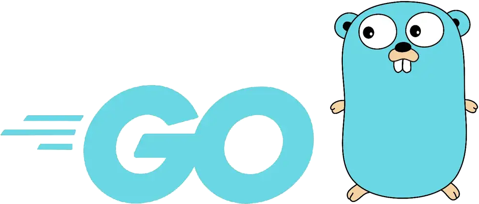
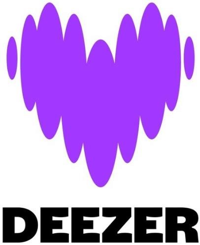

<!-- _class: lead -->

# Putting an end to Makefile in 
# projects with GoReleaser 

---

## ~$ whoami

Denis Germain

-  Site Reliability Engineer 
- French tech blogger : [blog.zwindler.fr](https://blog.zwindler.fr)*
 

  [@zwindler(@framapiaf.org)](https://framapiaf.org/@zwindler)

**#geek** 👨‍💻 **#SF** 🤖👽 **#runner** 🏃‍♂️

 

**the slides are on the blog*

---

<!-- _class: lead -->

# Putting an end to Makefile in 
# projects with GoReleaser 

---

## Why this talk???

- Golang = 💙, but compiling is 🥱
- Maintaining OSS projects === tedious actions 😴
  * ⚔️ cross-compiling
  * 🐋 building Docker images
  * 📦 making a bunch of packages
  * ✍🏼 signing/checksuming artefacts
  * 🚀 releases to git(hub|lab|ea)

---

## Solution 1 - do it yourself

- Makefile
- Jenkinsfile
- Github action / Gitlab runners
- Bash scripts "roulés sous les aisselles" 
- ...

---

## Solution 2 - GoReleaser

You can do all that, and more with [GoReleaser](https://goreleaser.com) !

---

## It's time to D-D-D-D-D-DEMO !

- [gitlab.com/dt.germain/fosdem-goreleaser](https://gitlab.com/dt.germain/fosdem-goreleaser)

---

## Conclusion & feedbacks

- ⚔️ cross-compilation
- 🐋 Docker image builds
- ✍🏼 signature + checksums
- 🚀 gitlab releases
-  posts on social medias / communication channels

 

   [@zwindler(@framapiaf.org)](https://framapiaf.org/@zwindler)

---

<!-- _class: lead -->

# Sources

- [GoReleaser official website](https://github.com/goreleaser/goreleaser)
- [GoReleaser official documentation](https://goreleaser.com/install)
- Sources
  - [gitlab.com/dt.germain/fosdem-goreleaser](https://gitlab.com/dt.germain/fosdem-goreleaser)
- [Variables for GoReleaser](https://goreleaser.com/customization/templates/)
- [Article in GNU/Linux Magazine France](https://connect.ed-diamond.com/gnu-linux-magazine/glmf-265/en-finir-avec-les-makefiles-en-go-avec-goreleaser)
