

<!-- _class: lead -->

# Ne perdez plus vos photos de vacances 🔥🏠🔥
## (ou tout autre fichier important)

---

## ~$ whoami

**Denis Germain** 👨‍💻🧙🔥🏃‍♂️
 
- Platform Engineer 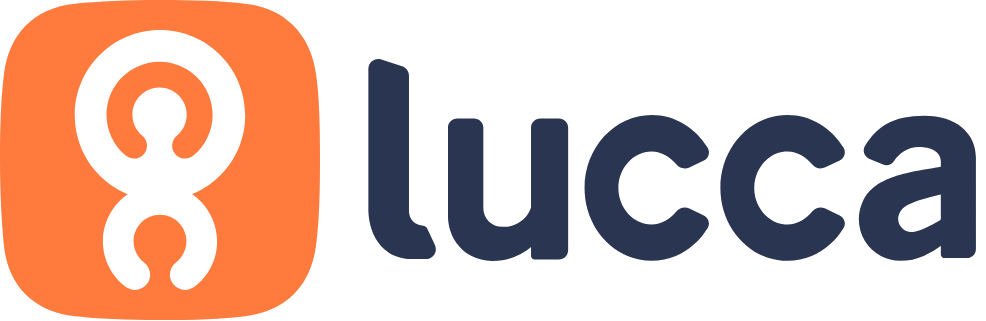 
  - (ex *Deezer, Lectra, E.Leclerc*)
- Admin k8s "the hard way" depuis 2017
- Blog tech (et +) : [blog.zwindler.fr](https://blog.zwindler.fr)
 

 [@zwindler.fr](https://bsky.app/profile/zwindler.fr)

 

---

<!-- _class: lead -->

# Ne perdez plus vos photos de vacances 🔥🏠🔥
## (ou tout autre fichier important)

---

<!-- _class: lead -->

# Le constat
## On sous-estime la valeur de nos données

---

## Données personnelles

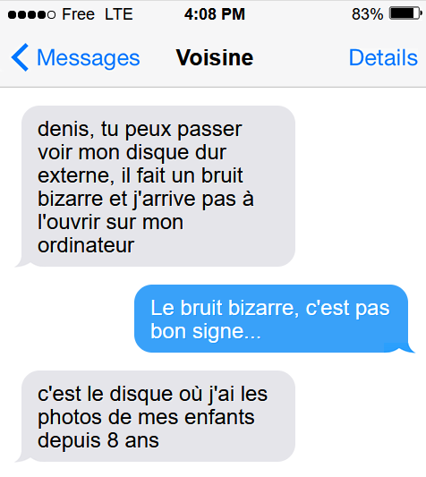

---

## Données professionnelles

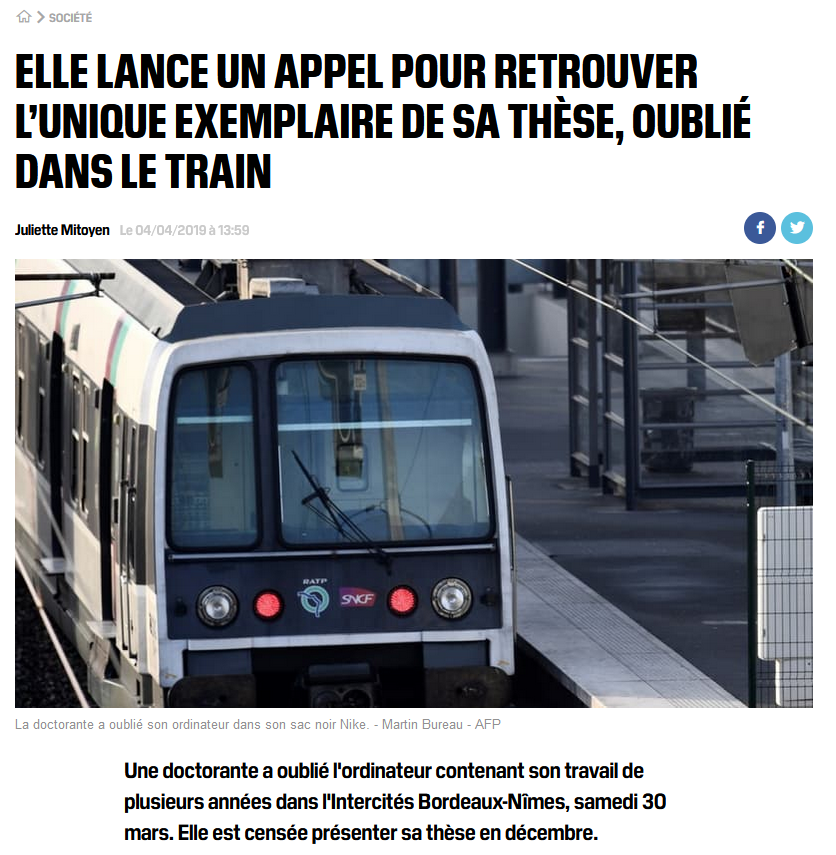

[source: bfmtv.com](https://www.bfmtv.com/societe/elle-lance-un-appel-pour-retrouver-l-unique-exemplaire-de-sa-these-oublie-dans-le-train_AN-201904040050.html)

---

## Et même parfois beaucoup d'argent !

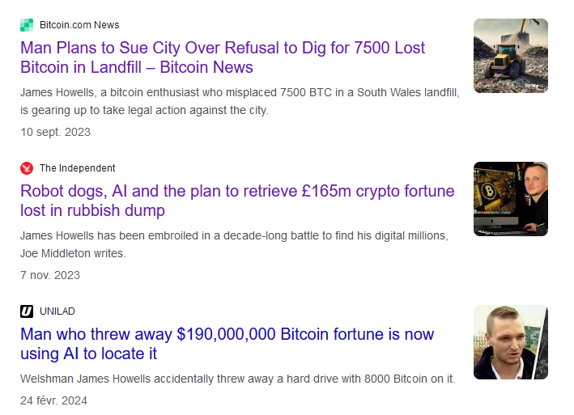

sources: [dailymail.co.uk](https://www.dailymail.co.uk/news/article-13226847/Inside-landfill-hiding-1-5bn-Bitcoin-council-bosses-wont-let-treasure-hunters-dig-up.html) / [next.ink](https://next.ink/brief_article/fin-dune-quete-de-11-ans-pour-retrouver-740-millions-deuros-en-bitcoin/)

---

<!-- _class: lead -->

# Comment se prémunir d'incidents ?

---

## Estimer les risques

* vol ou panne 🥷💻 (impact limité, probable)
* incendie de mon domicile 🔥🏠🔥 (impact important, plausible)
* chute de météorite sur le **Palais des Congrès** 🏙️☄️ (catastrophique, quasiment impossible)

---

## Respecter la stratégie "3-2-1"

- Un standard dans l'informatique professionnelle depuis *longtemps*
- Terme "inventé" par Peter Krogh (Digital Asset Management for Photographers)

> - 3 copies of data
> - On 2 different media
> - With 1 copy being off-site

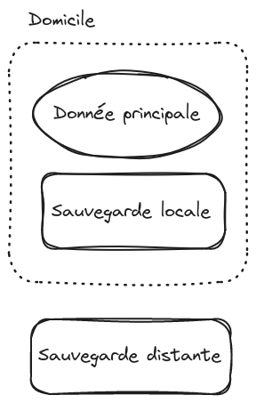

---

## De 3-2-1 à 3-2-1-1-0

La stratégie 3-2-1 ne tiens pas compte des **ransomwares**

> Logiciel malveillant qui chiffrent les données et parfois détruisent les sauvegardes

Avoir en plus une version "hors ligne" des données importantes

Ex. copie annuelle sur un disque dur **débranché**

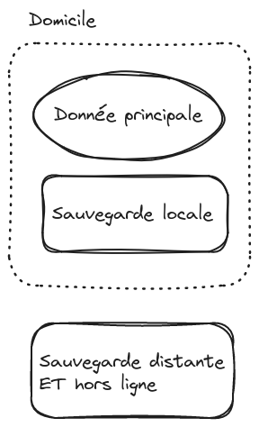

---

## Exemples de solutions 
### (à combiner)

- copier les données sur un disque dur externe ou des clés USB
- graver des CDs ou des DVDs 💿
- utiliser ✨ un NAS ✨
- utiliser des logiciels de sauvegarde
- utiliser un service de sauvegarde en ligne

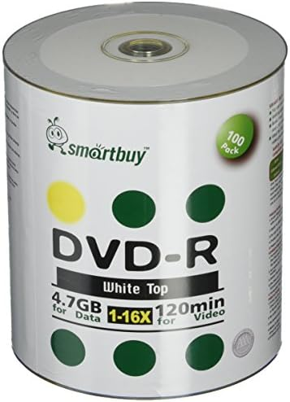

---

<!-- _class: lead -->

# Focus : les NAS

---

## C'est quoi un *NAS* ?

> Network Attached Storage

- 🖥️ compact, qui consomme peu ⚡
- dédiée au stockage des données
- accessible depuis tous vos appareils
- avec une  grande capacité (RAID)
- fonctionnalités sympas "en plus" 

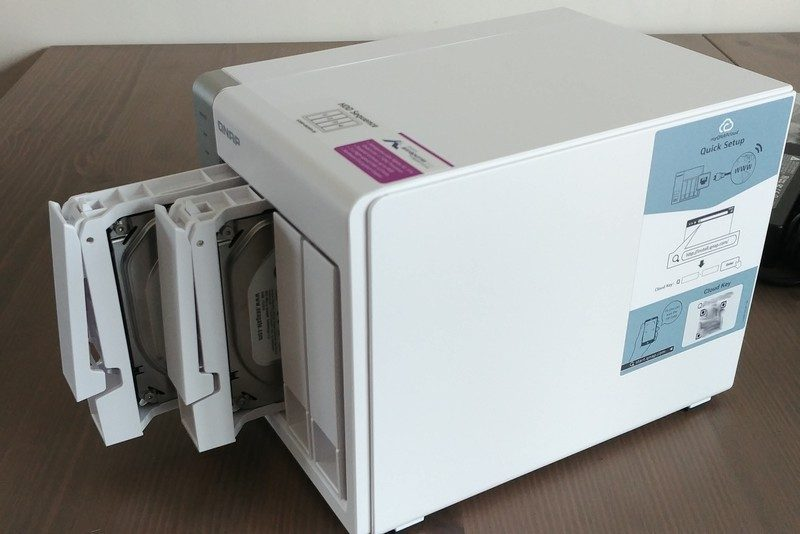

---

## Contruire son NAS, c'est rigolo

jonsbo N2, N100 4x2.5Gbps, TrueNAS, OpenZFS

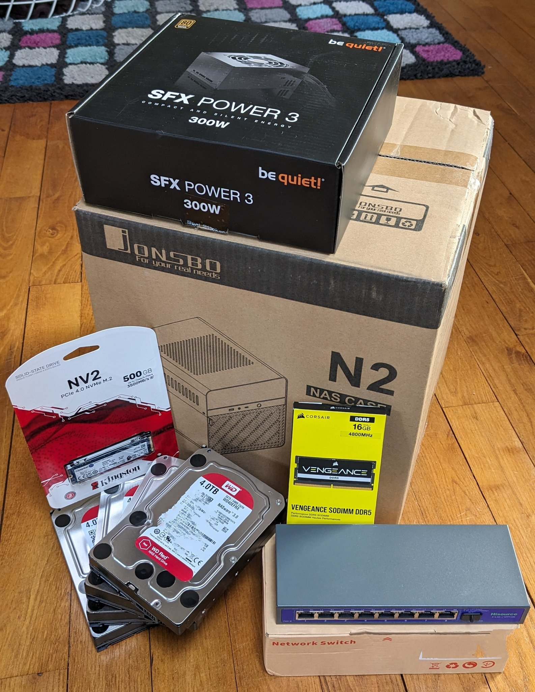 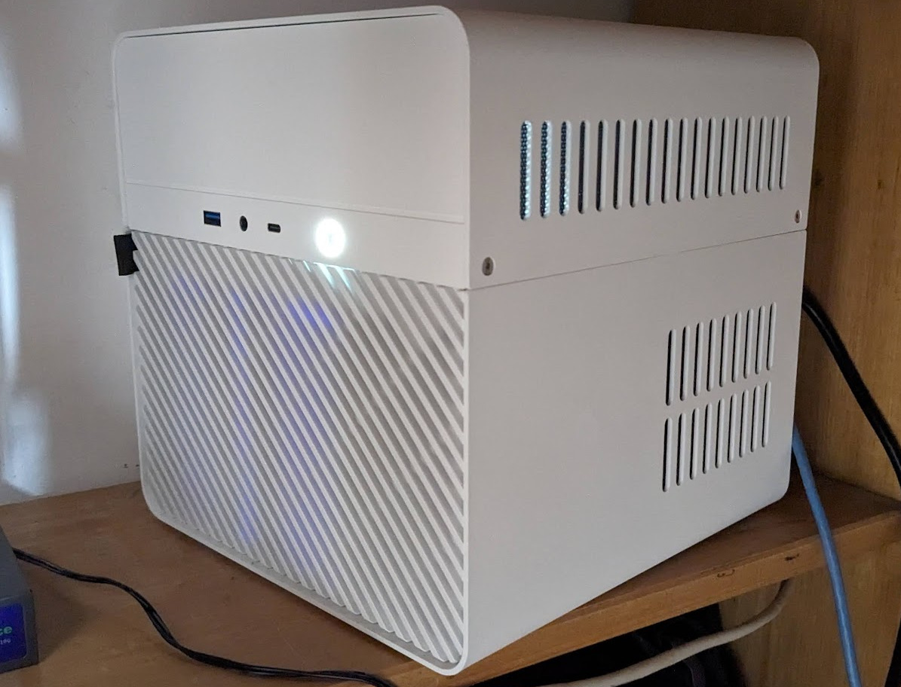 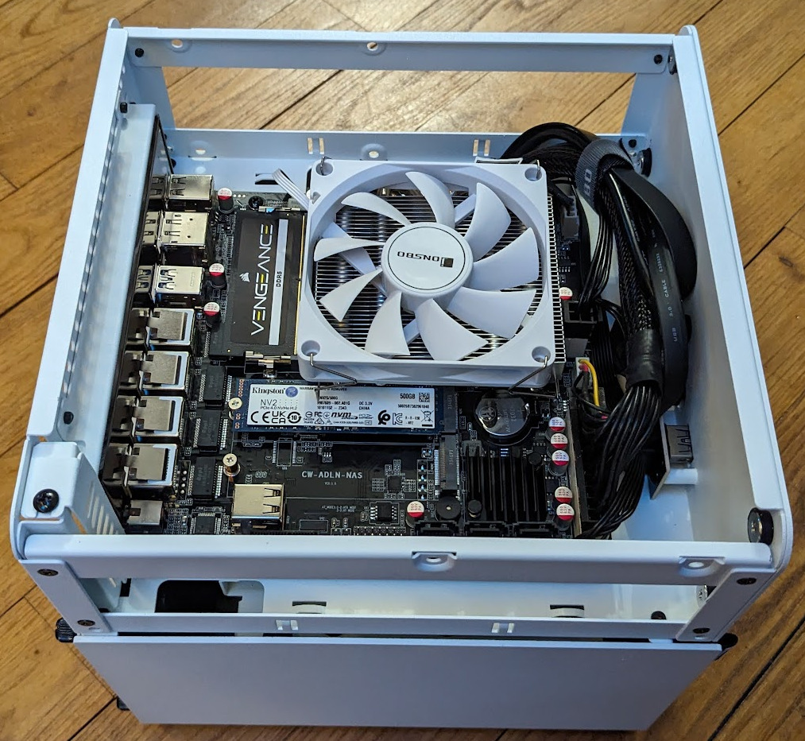

---

<!-- _class: lead -->

# Focus : services en ligne

---

## Services en ligne

- Services de synchronisation de données
  - Dropbox, Google Drive, iCloud...
  - souvent assez couteux
  - pas de stockage "offline"
- Services de sauvegarde Cloud
  - [Backblaze](https://www.backblaze.com/) (**ne retenez qu'eux**)

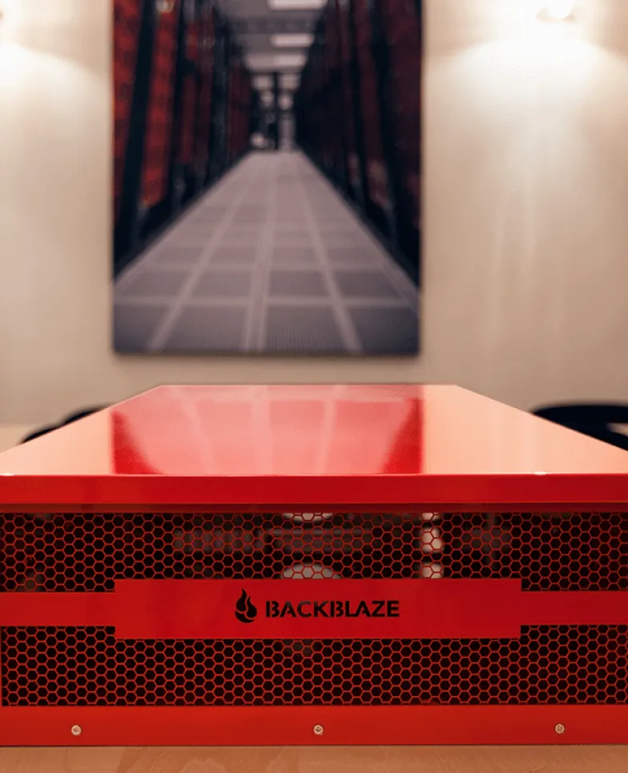

source: [backblaze.com](https://www.backblaze.com/cloud-storage/resources/storage-pod)

---

<!-- _class: lead -->

# Focus : logiciels de sauvegarde

---

## Logiciels de sauvegarde intégrés

- (avant) Windows 7-8 - Windows "Backup and Restore"
  - obsolète 🪦
- Windows 10-11 - Windows Backup
  - OneDrive 😵
  - simple mais très limité
- MacOS - TimeMachine (+ TimeCapsule)
  - les données restent locales

---

## On va faire mieux avec de l'open source !

- [restic](https://restic.net/) 28k⭐ (+ [backrest](https://github.com/garethgeorge/backrest))
- [duplicati](https://github.com/duplicati/duplicati) 12k⭐
  - backup chiffrées, en ligne ou hors ligne, locales ou cloud

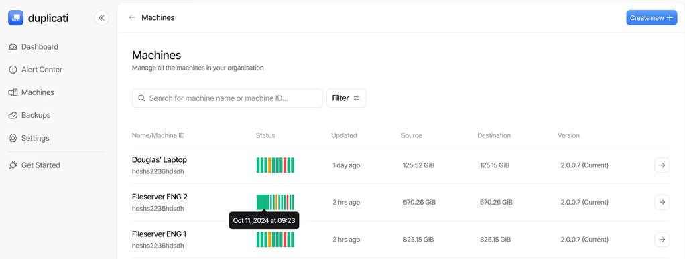

---

<!-- _class: lead -->

# Conclusion

---

## Conclusion

 

#### 1. Vos données (pro/perso) ont beaucoup de valeur
#### 2. Respectez la stratégie 3-2-1-1-0
#### 3. Un NAS est un chouette outil
#### 4. Mais pas suffisant (backup distante + hors ligne)

 

#### (bonus) Construire son propre NAS, c'est fun 🤓

---

<!-- _class: lead -->

# Merci !

