<style>

section {
  background-color: #fefefe;
  color: #333;
}

img[alt~="center"] {
  display: block;
  margin: 0 auto;
}
blockquote {
  background: #ffedcc;
  border-left: 10px solid #d1bf9d;
  margin: 1.5em 10px;
  padding: 0.5em 10px;
}
blockquote:before{
  content: unset;
}
blockquote:after{
  content: unset;
}
</style>

<!-- _class: lead -->

# Kubernetes : 5 façons créatives de flinguer sa prod 🔫

---

## Contexte

**Denis Germain** 👨‍💻🧙🔥🏃‍♂️
 
- Platform Engineer  
  - (ex *Deezer, ex Lectra, ex E.Leclerc*)
- Admin k8s "the hard way" depuis 2017
- Blog tech (et +) : [blog.zwindler.fr](https://blog.zwindler.fr)
- Auteur [50 nuances de Kubernetes](https://50ndk.zwindler.fr/)


 [@zwindler.fr](https://bsky.app/profile/zwindler.fr)


 

---


---

## Agenda

- Liveness, readiness et dépendances cycliques ♻️
- C’est quoi helm.sh/release.v1 ? Allez hop, je supprime ! 😈

- 2 VirtualServices (ou Ingress) pointent sur la même URL 🕳️
- Laisser expirer le Certificate Authority, c’est fun 🙊
- Who let the systemd-s out? (🐶,🐶, 🐶🐶)


---

<!-- _class: lead -->

# Liveness, Readiness 
# et dépendances cycliques ♻️

---

## Healthchecks, Liveness, Readiness

- Liveness probe ⇒ vérifie l’état de santé d’un Pod
- Readiness probe ⇒ vérifie qu’un Pod est prêt à recevoir du trafic

<table style="border-collapse: collapse; width: 70%;">
  <tr></tr>
  <tr>
    <td style="border: none; vertical-align: top;">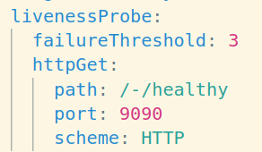</td>
    <td style="border: none; vertical-align: top;">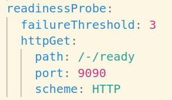</td>
  </tr>
</table>

- [kubernetes.io/docs/tasks/configure-pod-container/configure-liveness-readiness-startup-probes](https://kubernetes.io/docs/tasks/configure-pod-container/configure-liveness-readiness-startup-probes/)

---

## Un cluster TROP résilient


---

## Un cluster TROP résilient

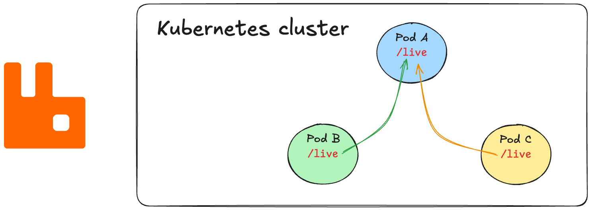

---

## Un cluster TROP résilient

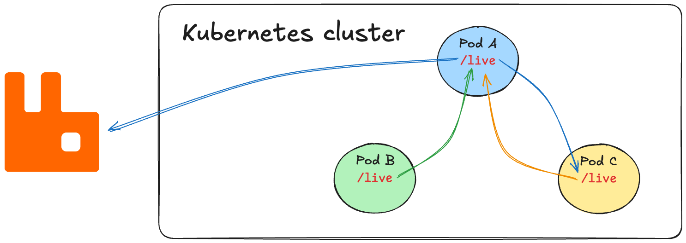

---

## Un cluster TROP résilient


---

## Un cluster TROP résilient


---

## Comment on s’en est sorti ?

- Suppression “*à la mano*” des **Liveness/Readiness**

- Modification des manifests (+ templates)

- Ecriture et adoption d'un "Document d’architecture" (bonnes pratiques)

---

## Mes "bonnes pratiques"

- Toutes les apps devraient en avoir !

- Liveness **!=** Readiness, il faut 2 URLs distinctes

- Pas de dépendances externes dans les liveness

- Avoir un *path* pour vérifier en blackbox que l’application va bien
  - Dépendances externes inclues
  - Ne pas utiliser les **liveness / readiness** pour ça

---

<!-- _class: lead -->

# helm.sh/release.v1 ?
# Allez hop, je supprime ! 😈

---

## Ménage un peu agressif

- Migration helm v2 ⇒ helm v3
- Ménage un peu trop zélé suite à la migration helm v2 ⇒ v3
- Bug dans la Chart et/ou helm ([issues](https://github.com/helm/helm/issues/5595#issuecomment-484438288))

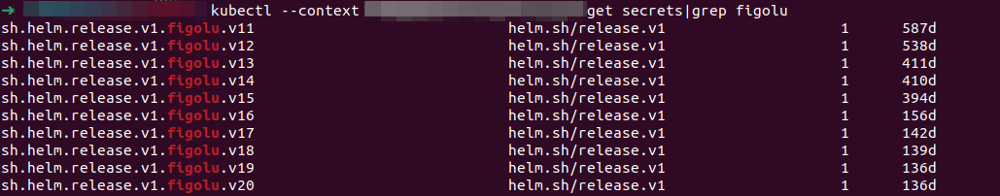


---

## On est coincés

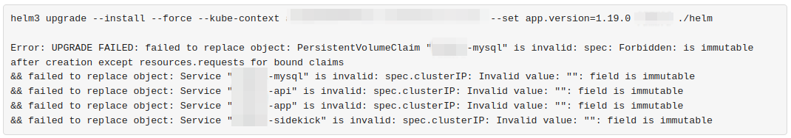

- Plus de release = le `helm upgrade`  échoue, le `helm install` aussi

- Pas de solution simple pour revenir en arrière sans interruption
  - ex. `helm delete --purge` puis `helm install`


---

## Comment on s’en est sorti ?

- Restauration d’un sauvegarde **etcd**, extraction des entrées concernés, apply à la main de la release
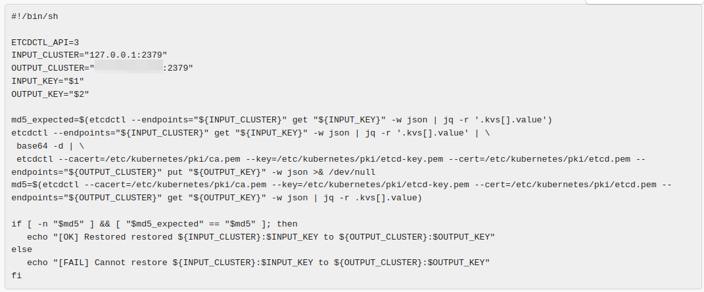

-  On aurait pu utiliser Velero (cf [le talk de Rémi Verchère](https://www.youtube.com/watch?v=LlryJwgRXf4))

---

## Et avec du GitOps ?

- argoCD n'utilise pas `helm`, c'est du "helm like"
  - pas les bugs de `helm` (mais on en a d'autres 😛)

- fluxCD utilise `helm`, mais le problème aurait été le même ici 
<br/>

- En règle générale, le GitOps, c’est quand même beaucoup mieux
  - Moins d’actions manuelles = moins d’erreurs humaines
  - **Single Source of Truth**

---

<!-- _class: lead -->

# 2 VirtualServices (ou Ingress) pointent sur la même URL 🕳️

---

## Rappel : Ingress / VirtualService

- [Ingress](https://kubernetes.io/fr/docs/concepts/services-networking/ingress/) : objet Kubernetes qui gère l'accès externe aux services dans un cluster, généralement du trafic HTTP
- [VirtualService](https://istio.io/latest/docs/reference/config/networking/virtual-service/) : “pareil”, mais c'est une CRD Istio (service mesh)
<br/>

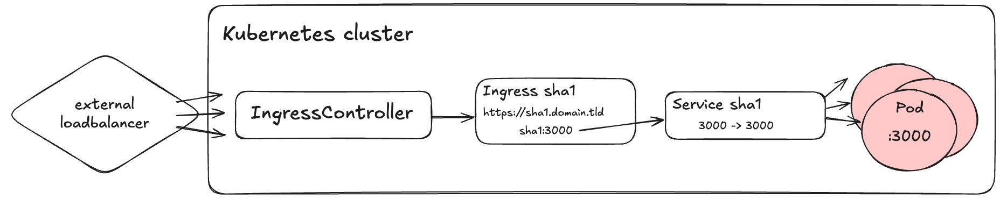

---

## URL de Schrödinger

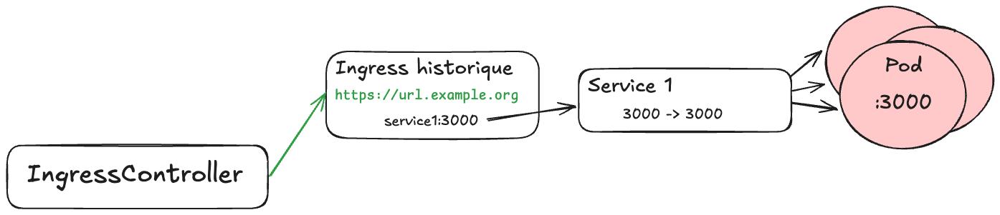

---

## URL de Schrödinger

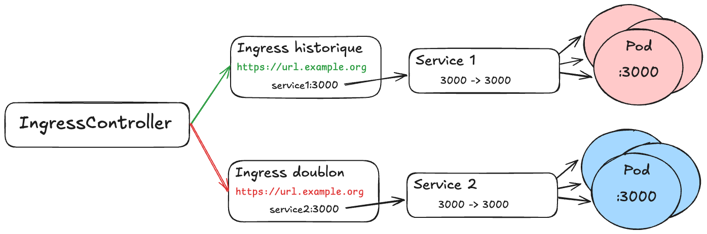

---

## URL de Schrödinger

Des requêtes sont envoyées sur les mauvais Service Kubernetes :

- Erreurs HTTP 400/500 en pagaille côté client
- Difficile à debug
  - Applications Live & Ready
  - Pas d'erreur flagrante côté serveur 
  - Requêtes routées en amont sur le mauvais backend
<br/>

Moralité : **K8s vous laissera souvent faire des bêtises**

---

## Solution : empêcher certaines actions

Interdire la création d’Ingress (ou de VirtualService) si jamais l’URL existe déjà dans Kubernetes

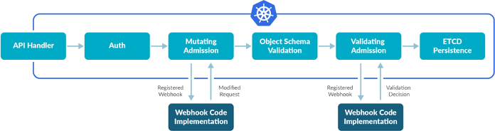

- [kubernetes.io/docs/reference/access-authn-authz/extensible-admission-controllers](https://kubernetes.io/docs/reference/access-authn-authz/extensible-admission-controllers/)

---

## Ca "fonctionne", mais ce n'est pas très user friendly

REX Yahoo à l'aide d'un ValidatingWebhook :

- [Talk "101 Ways to “Break and Recover” Kubernetes Cluster" (Kubecon EU 2018) - youtu.be/likHm-KHGWQ](https://youtu.be/likHm-KHGWQ?feature=shared&t=731)

 

---

## Avec Kyverno 

<table style="border-collapse: collapse; width: 100%;">
  <colgroup>
    <col style="width: 400px;">
    <col style="width: auto;">
  </colgroup>
  <tr></tr>
  <tr>
    <td style="border: none; vertical-align: top;">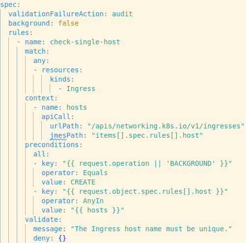</td>
    <td style="border: none; vertical-align: top;">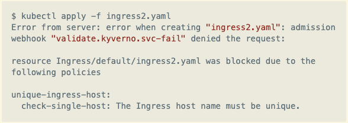</td>
  </tr>
</table>

---

## Quelques liens pour aller plus loin 

Exemples sur le [blog.zwindler.fr](https://blog.zwindler.fr) :

- [blog.zwindler.fr/2022/08/01/vos-politiques-de-conformite-sur-kubernetes-avec-kyverno](https://blog.zwindler.fr/2022/08/01/vos-politiques-de-conformite-sur-kubernetes-avec-kyverno)

- [blog.zwindler.fr/2020/07/20/vos-politiques-de-conformite-sur-kubernetes-avec-opa-et-gatekeeper](https://blog.zwindler.fr/2020/07/20/vos-politiques-de-conformite-sur-kubernetes-avec-opa-et-gatekeeper)

---

<!-- _class: lead -->

# Laisser expirer le Certificate Authority, c’est fun 🙊

---

## Dans Kubernetes, tous les flux sont chiffrés

- Kubernetes Managé : cette partie est gérée par le provider ✅
- Avec `kubeadm` (et autre) : certificats automatisés ⚠️
- Nous : **YOLO** 😎
<br/>

[kubernetes.io/docs/setup/best-practices/certificates](https://kubernetes.io/docs/setup/best-practices/certificates/)

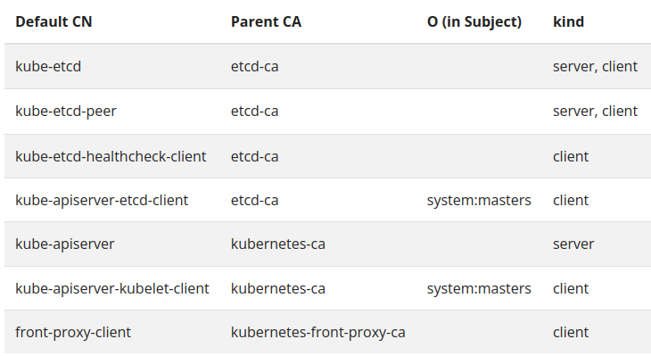

---

- Tout est KO (oh-ooooh 🎵) :
  - client (`kubectl`) ⇔ api-server
  - Nodes (`kubelet`) ⇔ api-server
  - scheduler ⇔ api-server
  - ctrl-manager ⇔ api-server
  - CNI plugin ⇔ api-server
  - **et api-server ⇔ etcd**

- Et… tous les tokens !
  - CoreDNS
  - Toutes les apps ⇔ api-server

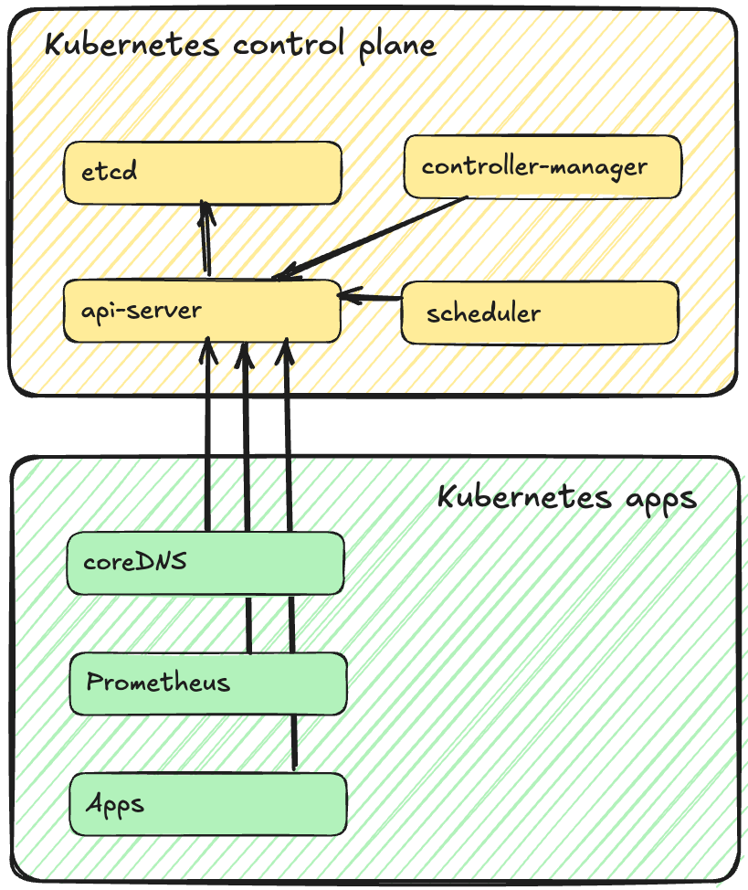

---

## Comment on s’en sort ? (1/2)

1. Renouveler tous les CA, puis tous les certificats signés avec
2. Redémarrer `etcd` et vérifier que le cluster se reforme
3. Redémarrer l’`api-server` (kill processus)
4. Redémarrer le CNI plugin
5. Supprimer les certificats du `kubelet` et le redémarrer

A partir de là, on peut de nouveau interagir avec l’API server

---

## Comment on s’en sort ? (2/2)

6. Redémarrer le `controller-manager` et le `scheduler`
7. Mettre à jour les tokens de tous les **ServiceAccount** kubernetes

```
for ns in `kubectl get ns | grep Active | awk '{ print $1 }'`; do
    for token in `kubectl get svc -n $ns --field-selector type=kubernetes.io/service-account-token -o name`; do
        kubectl get $token -n $ns -o yaml | /bin/sed '/token: /d' | /usr/bin/kubectl replace -f - ;
    done
done
```

8. Redémarrer tout ce qui communique avec l’API server

[blog.zwindler.fr/2021/02/15/mettre-a-jour-le-ca-de-kubernetes-the-hard-way/](https://blog.zwindler.fr/2021/02/15/mettre-a-jour-le-ca-de-kubernetes-the-hard-way/)

---

## Mes "bonnes pratiques"

- Ajouter du monitoring sur les certificats 
(ex. [github.com/enix/x509-certificate-exporter](https://github.com/enix/x509-certificate-exporter))

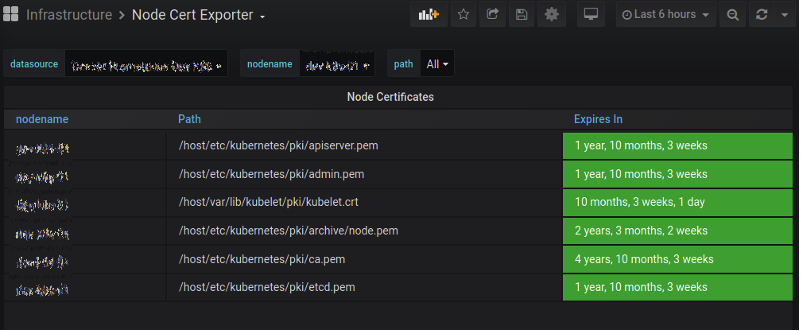

- Ne pas gérer les certificats “The Hard Way” 🤡
- Ne pas utiliser les tokens pour les SA (TokenRequest API)

---

<!-- _class: lead -->

# Who let the systemd-s out?
# (🐶,🐶, 🐶🐶)

---

## Contexte

Migration d'un cluster Kubernetes (Debian 10 + "the hard way") vers un cluster `kubeadm`

- **OS** : Ubuntu 22.04
- **CNI plugin** : Cilium
- **Nodes** : baremetal gérés en gitops
  - philosophie "cattle" (vs pets)

---

## En pleine migration (7 mars 2023)

Après des mises à jour, des **Nodes** commencent à :

- ne répondre *que* sur l'IP de management
  - les autres interfaces sont KO
- tous les containers sont up mais injoignables
  - liveness / readiness KO
  - crashloops des composants du control-plane


---

## En pleine migration (7 mars 2023)

Après des mises à jour, des **Nodes** commencent à :

- ne répondre *que* sur l'IP de management
  - les autres interfaces sont KO
- tous les containers sont up mais injoignables
  - liveness / readiness KO
  - crashloops des composants du control-plane
- **réinstaller les Nodes ne résoud pas le problème**


---

## Un drame en 3 étapes (1/2)

- Décembre 2020 :
  - systemd (v248) introduit un nouveau comportement dans `systemd-network`d : au démarrage, supprime toutes les règles de routage IP qu'il ne connaît pas
- Avril 2021 :
  - Ajout d'un paramètre `ManageForeignRoutingPolicyRules=` dans systemd v249 permet de désactiver ce comportement

---

## Un drame en 3 étapes (2/2)

- 7 mars 2023 :
  - Un patch pour une CVE dans systemd est disponible dans les dépôts Ubuntu (`249.11-0ubuntu3.7`).
  - L'installation de ce patch redémarre systemd-networkd, qui flush toutes les IPs
- Dès que la mise à jour est appliquée, flush la table de routage

```
Destination Net Unreachable
```

---

## Mes bonnes pratiques

- Supprimer systemd ? 
- Ne pas mettre à jour les **Nodes** ? 


* En vrai, c'est pas si bête
  - Qonto : pas de MAJ, TTL de 24h sur tous les Nodes
* OS Immutable et minimaliste
  -  Talos Linux 
  -  Flatcar

<br/>

[Part 2: A Deep Dive into the Platform-level Impact](https://www.datadoghq.com/blog/engineering/2023-03-08-deep-dive-into-platform-level-impact/)

---

<!-- _class: lead -->

# Takeways


---

## Kubernetes, c'est compliqué ?

1. L'observabilité = LA BASE sur Kubernetes
2. Actions manuelles = incident (**#GitOps**)
3. Kubernetes nécessite des garde fou
    - Kyverno / OPA 
4. Ne faites rien "the hard way"
5.  Adoptez l'approche Cattle pour vos **Nodes**

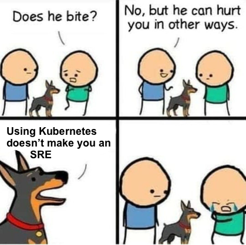
 [@zwindler.fr](https://bsky.app/profile/zwindler.fr)

